# Disciplina de Requisitos

## Índice

1. [Encontrar Actores y Casos de Uso](#1-encontrar-actores-y-casos-de-uso)
   - 1.1 [Identificación de Actores](#11-identificación-de-actores)
   - 1.2 [Criterio de diseño del modelo](#12-criterio-de-diseño-del-modelo)
   - 1.3 [Lista de Casos de Uso](#13-lista-de-casos-de-uso)
   - 1.4 [Diagramas de Casos de Uso](#14-diagramas-de-casos-de-uso-por-actor)
2. [Priorizar Casos de Uso](#2-priorizar-casos-de-uso)
3. [Detallar Casos de Uso](#3-detallar-casos-de-uso)
4. [Prototipar Casos de Uso](#4-prototipar-casos-de-uso)
5. [Estructurar el Modelo de Casos de Uso](#5-estructurar-el-modelo-de-casos-de-uso)

---

## 1. Encontrar Actores y Casos de Uso

### 1.1 Identificación de Actores

| Actor | Descripción | Identificación en Odoo | Alcance de datos |
|---|---|---|---|
| **Director** | Máximo responsable de la organización. Acceso irrestricto a todo el sistema, incluido el módulo de rentabilidad financiera. | Nodo raíz del árbol jerárquico de empleados | Global — sin filtro |
| **Responsable** | Jefe de departamento o responsable de proyecto. Acceso filtrado a su ámbito organizativo calculado en el momento de la autenticación. | Gestiona al menos un departamento o proyecto | Filtrado por empleados, departamentos y proyectos bajo su responsabilidad |

> Los empleados rasos **no tienen acceso** al sistema y son redirigidos al login.
> El rol y el ámbito de cada usuario se determinan en el momento de la autenticación.

| Actor externo | Descripción | Conexión |
|---|---|---|
| **Sistema ERP (Odoo v16)** | Actor externo. Fuente única de datos. El módulo de analítica solo lee de su base de datos. | Solo lectura — el sistema consulta al ERP, no al contrario |

#### Diagrama de relaciones entre actores y sistema
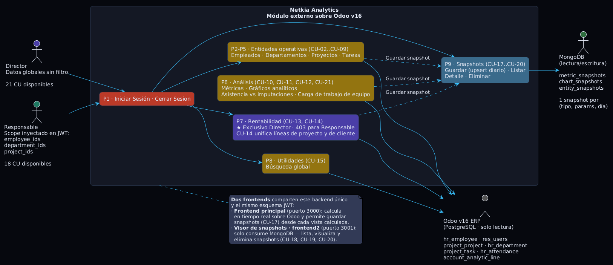

---

### 1.2 Criterio de diseño del modelo

El modelo se organiza alrededor de un principio de **simetría por entidad**: cada entidad principal del dominio expone exactamente dos casos de uso:

| Entidad | CU de listado/búsqueda | CU de resumen analítico |
|---|---|---|
| Empleado | CU-02 Listar Empleados | CU-03 Resumen de Empleado |
| Departamento | CU-04 Listar Departamentos | CU-05 Resumen de Departamento |
| Proyecto | CU-06 Listar Proyectos | CU-07 Resumen de Proyecto |
| Tarea | CU-08 Listar Tareas | CU-09 Detalle de Tarea |

Los CU de resumen son el panel analítico de cada entidad: agregan indicadores, métricas y accesos a recursos relacionados. Las métricas operativas (Paquete 6) se consumen tanto desde los resúmenes de entidad como desde la página de métricas.

---

### 1.3 Lista de casos de uso
 
El sistema se organiza en **10 paquetes funcionales** que agrupan los
**20 casos de uso** identificados. Los CUs marcados con ★ son
exclusivos del rol *Director*; el resto están disponibles para ambos
actores (*Director* y *Responsable*) con el filtrado de ámbito que
corresponda a cada uno.
 
| Paquete | CU | Nombre | Director | Responsable |
|---|---|---|---|---|
| **P1 · Autenticación** | CU-01 | Autenticarse en el sistema | ✅ | ✅ |
|                        | CU-16 | Cerrar sesión | ✅ | ✅ |
| **P2 · Empleados**     | CU-02 | Listar y buscar empleados | ✅ | ✅ [scope] |
|                        | CU-03 | Visualizar resumen de empleado | ✅ | ✅ [scope] |
| **P3 · Departamentos** | CU-04 | Listar departamentos | ✅ | ✅ [scope] |
|                        | CU-05 | Visualizar resumen de departamento | ✅ | ✅ [scope] |
| **P4 · Proyectos**     | CU-06 | Listar proyectos | ✅ | ✅ [scope] |
|                        | CU-07 | Visualizar resumen de proyecto | ✅ | ✅ [scope] |
| **P5 · Tareas**        | CU-08 | Listar y filtrar tareas | ✅ | ✅ [scope] |
|                        | CU-09 | Consultar detalle de tarea | ✅ | ✅ [scope] |
| **P6 · Métricas**      | CU-10 | Consultar métrica operativa *(parametrizada)* | ✅ | ✅ [scope] |
| **P7 · Análisis visual** | CU-11 | Visualizar gráficos analíticos | ✅ | ✅ [scope] |
|                          | CU-12 | Consultar asistencia vs imputaciones | ✅ | ✅ [modo equipo] |
| **P8 · Rentabilidad ★** | CU-13 | Analizar rentabilidad financiera ★ | ✅ | ❌ |
|                         | CU-14 | Consultar líneas analíticas *(scope: proyecto &#124; cliente)* ★ | ✅ | ❌ |
| **P9 · Utilidades**    | CU-15 | Realizar búsqueda global | ✅ | ✅ [scope] |
| **P10 · Snapshots**    | CU-17 | Guardar snapshot *(upsert diario)* | ✅ | ✅ |
|                        | CU-18 | Listar snapshots | ✅ | ✅ |
|                        | CU-19 | Consultar detalle de snapshot | ✅ | ✅ |
|                        | CU-20 | Eliminar snapshot | ✅ | ❌ |
 
**Totales:** Director → 20 CU · Responsable → 17 CU (excluidos CU-13 y CU-14).
 
#### Observaciones sobre la consolidación de CUs
 
Durante la identificación se han aplicado tres consolidaciones alineadas
con los principios de RUP (mismo actor, misma precondición, misma
postcondición, mismo flujo principal; solo difiere un parámetro):
 
- **CU-10 Consultar Métrica Operativa** es un caso de uso único que
  sirve a 15 servicios de métrica (productividad, WIP, workload, riesgo,
  compliance, lead time, estimation, cancelled tasks, client distribution,
  stage time, rework, project efficiency, rentability, etc.). La elección
  de la métrica se modela como parámetro del CU, no como CUs separados.
  Este CU absorbe además "Supervisar Carga de Equipo".
- **CU-14 Consultar Líneas Analíticas** unifica en un único CU el
  drill-down de líneas analíticas por proyecto y por cliente que antes
  eran dos CUs separados. El scope (`proyecto | cliente`) se modela como
  parámetro.
- **Guardar/Actualizar Snapshot** se modela como un único CU-17
  con semántica *upsert diario*. Dado que existe como máximo una
  snapshot por (tipo, parámetros, día), volver a guardar el mismo día
  sobrescribe la anterior. No existe CU separado de "Actualizar
  Snapshot"; la actualización queda embebida como flujo alternativo
  FA-01 de CU-17.

---

### 1.4 Diagramas de Casos de Uso por Actor

|Director|Responsable|
|--------|-----------|
||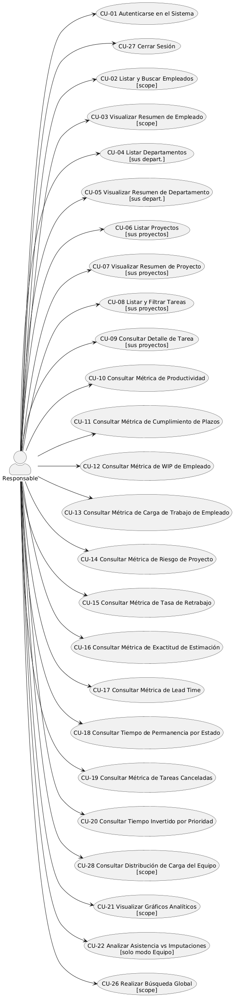|
|[Ver código](./diagramas/actorDirector.puml)|[Ver código](./diagramas/actorResponsable.puml)|

Ambos actores comparten la mayoría de los casos de uso. El Director tiene acceso exclusivo al módulo de rentabilidad financiera (CU-13, CU-14). El Responsable opera siempre con un filtro automático sobre su ámbito organizativo.

**Resumen rápido:**
- **Director:** Acceso a los 20 CU sin restricciones de ámbito.
- **Responsable:** Acceso a 17 CU con filtro de ámbito (excluidos CU-13, CU-14 y CU-20).

---

## 2. Priorizar Casos de Uso

### 2.1 Criterios

| Criterio | Descripción | Escala |
|---|---|---|
| **Criticidad** | ¿Bloquea la ejecución de otros CU? | 1–3 |
| **Valor de negocio** | ¿Apoya decisiones estratégicas o tácticas? | 1–3 |
| **Frecuencia de uso** | ¿Se ejecuta en cada sesión o esporádicamente? | 1–3 |
| **Riesgo técnico** | ¿Implica lógica compleja o integración crítica con el ERP? | 1–3 |

#### Prioridad Alta (A) — MVP imprescindible
 
| CU | Nombre | Justificación |
|---|---|---|
| CU-01 | Autenticarse | Sin autenticación no hay sistema. Puerta de entrada. |
| CU-02 | Listar empleados | Dato base para todos los paneles de empleado. |
| CU-03 | Resumen de empleado | Vista canónica de consulta operativa diaria. |
| CU-06 | Listar proyectos | Dato base para paneles de proyecto y rentabilidad. |
| CU-07 | Resumen de proyecto | Vista canónica sobre el estado de un proyecto. |
| CU-08 | Listar tareas | Consulta operativa de alta frecuencia. |
| CU-10 | Consultar métrica operativa | KPIs que guían la decisión diaria (15 métricas). |
| CU-13 | Rentabilidad financiera ★ | KPI económico global del Director. |
| CU-17 | Guardar snapshot | Permite persistir el estado para seguimiento histórico. |
 
#### Prioridad Media (M) — complementarios
 
| CU | Nombre | Justificación |
|---|---|---|
| CU-04 | Listar departamentos | Exploración por estructura organizativa. |
| CU-05 | Resumen de departamento | Soporte al análisis de carga agregada. |
| CU-09 | Detalle de tarea | Profundización puntual sobre una tarea. |
| CU-11 | Gráficos analíticos | Análisis visual complementario. |
| CU-12 | Asistencia vs imputaciones | Control de coherencia horaria. |
| CU-14 | Líneas analíticas ★ | Drill-down contextual sobre rentabilidad (scope: proyecto &#124; cliente). |
| CU-18 | Listar snapshots | Consumo del histórico persistido. |
| CU-19 | Detalle de snapshot | Reconstrucción de vistas guardadas. |
 
#### Prioridad Baja (B) — opcionales
 
| CU | Nombre | Justificación |
|---|---|---|
| CU-15 | Búsqueda global | Atajo de navegación; no imprescindible. |
| CU-16 | Cerrar sesión | Deseable pero no bloqueante (expiración JWT). |
| CU-20 | Eliminar snapshot | Operación excepcional; uso puntual. |

---

## 3. Detallar Casos de Uso

Todos los casos de uso están documentados en detalle en: [Disciplina de Requisitos – Casos de Uso Detallados](./docs/CasosDeUsoDetallados.md)

### CU-01 – Autenticarse en el Sistema

| Campo | Valor |
|---|---|
| **Actores** | Director, Responsable |
| **Precondición** | El usuario dispone de credenciales válidas en el sistema ERP con un empleado activo vinculado. |
| **Postcondición** | El usuario tiene una sesión activa y accede al sistema con el rol y ámbito que le corresponden. |

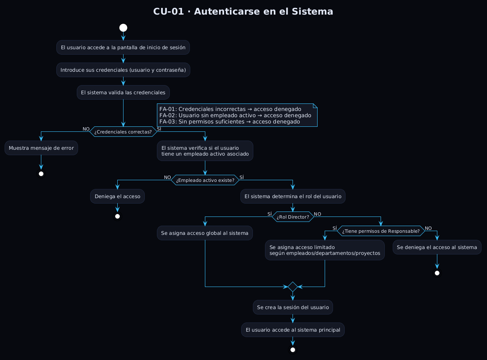

**Flujo principal:**
1. El actor accede a la pantalla de inicio de sesión e introduce sus credenciales.
2. El sistema valida las credenciales contra el ERP.
3. El sistema verifica que existe un empleado activo asociado al usuario.
4. El sistema determina el rol del usuario: Director (acceso global) o Responsable (acceso filtrado).
5. Para el Responsable, el sistema calcula el ámbito organizativo que le corresponde.
6. Se crea la sesión del usuario y se redirige a la pantalla principal.

**Flujos alternativos:**
- `FA-01`: Credenciales incorrectas → mensaje de error, permanece en el login.
- `FA-02`: Sin empleado activo vinculado → acceso denegado.
- `FA-03`: Usuario sin permisos de acceso al sistema → acceso denegado con mensaje informativo.
- `FA-04`: Sesión expirada → el sistema cierra la sesión y redirige al login.

**Relaciones:** CU-01 es precondición de todos los demás CU.

---

### CU-02 – Listar y Buscar Empleados

| Campo | Valor |
|---|---|
| **Actores** | Director, Responsable |
| **Precondición** | CU-01 completado. |
| **Postcondición** | El actor localiza el empleado buscado y puede navegar a CU-03. |

**Flujo principal:**
1. El actor accede al listado de empleados.
2. El sistema muestra los empleados disponibles según su rol y ámbito.
3. El actor puede filtrar por nombre, departamento o estado (activo/inactivo).
4. El sistema actualiza el listado paginado con los filtros aplicados.
5. El actor selecciona un empleado para consultar su resumen.

**Flujos alternativos:**
- `FA-01`: Sin resultados con los filtros aplicados → estado vacío con mensaje.

**Relaciones:** Navega a CU-03.

---

### CU-03 – Consultar Resumen de Empleado

| Campo | Valor |
|---|---|
| **Actores** | Director, Responsable |
| **Precondición** | CU-01 completado. El empleado pertenece al ámbito del actor. |
| **Postcondición** | El actor conoce el estado completo del empleado: carga, WIP, productividad y tareas. |

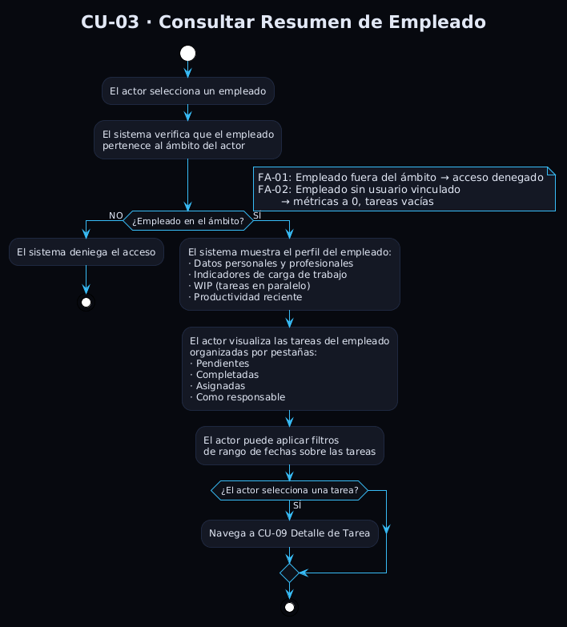

**Flujo principal:**
1. El actor selecciona un empleado desde CU-02 o CU-05.
2. El sistema verifica que el empleado pertenece al ámbito del actor.
3. El sistema muestra el perfil del empleado con sus indicadores de rendimiento.
4. El actor navega por las pestañas de tareas (pendientes, completadas, asignadas, como responsable).
5. El actor puede filtrar las tareas por rango de fechas.
6. El actor puede seleccionar una tarea para ver su detalle.

**Flujos alternativos:**
- `FA-01`: Empleado fuera del ámbito → acceso denegado.
- `FA-02`: Empleado sin usuario vinculado → indicadores a 0, tareas vacías.

**Relaciones:** `<<extend>>` por CU-08 (listados de tareas contextuales). Navega a CU-09.

---

### CU-04 – Listar Departamentos

| Campo | Valor |
|---|---|
| **Actores** | Director, Responsable |
| **Precondición** | CU-01 completado. |
| **Postcondición** | El actor localiza el departamento y puede navegar a CU-05. |

**Flujo principal:**
1. El actor accede al listado de departamentos.
2. El sistema muestra los departamentos activos disponibles según su ámbito.
3. El actor selecciona un departamento para consultar su resumen.

**Flujos alternativos:**
- `FA-01`: Sin departamentos en el ámbito → estado vacío.

**Relaciones:** Navega a CU-05.

---

### CU-05 – Consultar Resumen de Departamento

| Campo | Valor |
|---|---|
| **Actores** | Director, Responsable |
| **Precondición** | CU-01 completado. El departamento pertenece al ámbito del actor. |
| **Postcondición** | El actor conoce el estado de carga del departamento y puede navegar a sus empleados. |

**Flujo principal:**
1. El actor selecciona un departamento desde CU-04.
2. El sistema verifica que el departamento pertenece al ámbito del actor.
3. El sistema muestra el panel con nombre, responsable e indicadores de distribución de carga.
4. El sistema alerta visualmente si hay empleados sobrecargados.
5. El actor puede consultar la carga de trabajo o el listado de empleados mediante pestañas.
6. El actor puede seleccionar un empleado para acceder a su resumen.

**Flujos alternativos:**
- `FA-01`: Departamento fuera del ámbito → acceso denegado.
- `FA-02`: Departamento sin empleados → pestañas vacías.

**Relaciones:** Navega a CU-03.

---

### CU-06 – Listar Proyectos

| Campo | Valor |
|---|---|
| **Actores** | Director, Responsable |
| **Precondición** | CU-01 completado. |
| **Postcondición** | El actor localiza el proyecto y puede navegar a CU-07. |

**Flujo principal:**
1. El actor accede al listado de proyectos.
2. El sistema muestra los proyectos activos disponibles según su ámbito.
3. El actor selecciona un proyecto para consultar su resumen.

**Flujos alternativos:**
- `FA-01`: Sin proyectos en el ámbito → estado vacío.

**Relaciones:** Navega a CU-07.

---

### CU-07 – Consultar Resumen de Proyecto

| Campo | Valor |
|---|---|
| **Actores** | Director, Responsable |
| **Precondición** | CU-01 completado. El proyecto pertenece al ámbito del actor. |
| **Postcondición** | El actor conoce el estado completo del proyecto: eficiencia, riesgo, rentabilidad, tareas y equipo. |

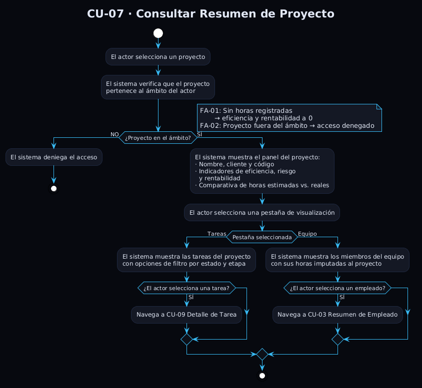

**Flujo principal:**
1. El actor selecciona un proyecto desde CU-06 o desde los resultados de CU-26.
2. El sistema verifica que el proyecto pertenece al ámbito del actor.
3. El sistema muestra el panel del proyecto con indicadores de eficiencia, riesgo y rentabilidad.
4. El actor puede consultar las tareas del proyecto o los miembros del equipo mediante pestañas.
5. El actor puede filtrar las tareas por estado o etapa.
6. El actor puede seleccionar una tarea o un empleado para ver su detalle.

**Flujos alternativos:**
- `FA-01`: Sin horas registradas → rentabilidad y eficiencia a 0.
- `FA-02`: Proyecto fuera del ámbito → acceso denegado.

**Relaciones:** Navega a CU-03 y CU-09.

---

### CU-08 – Listar Tareas

| Campo | Valor |
|---|---|
| **Actores** | Director, Responsable |
| **Precondición** | CU-01 completado. |
| **Postcondición** | El actor localiza las tareas buscadas o accede a su detalle (CU-09). |

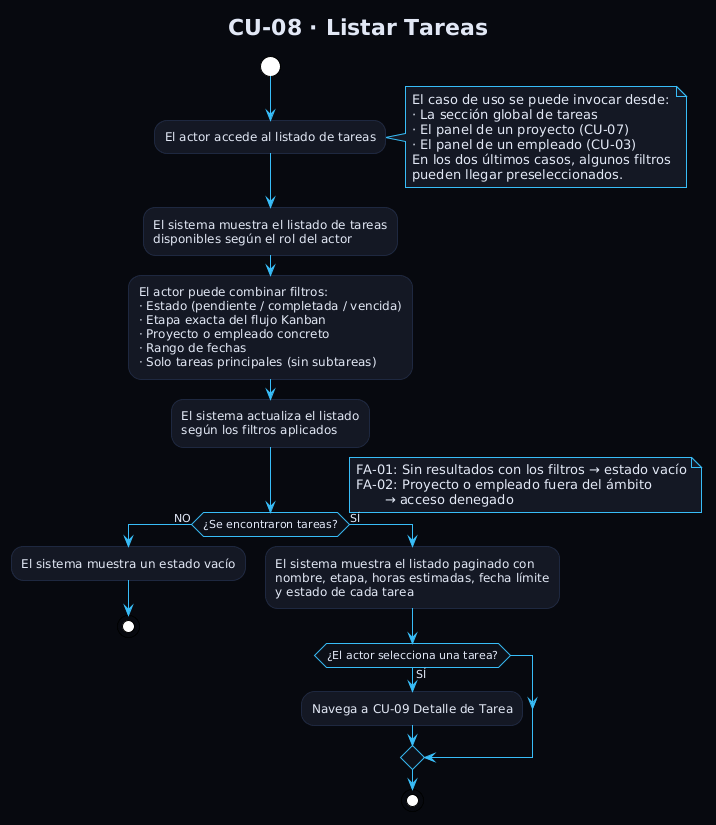

**Flujo principal:**
1. El actor accede al listado de tareas, bien desde la sección global, bien desde CU-07 o CU-03.
2. El sistema muestra las tareas disponibles según el ámbito del actor, con los filtros contextuales preseleccionados si los hubiera.
3. El actor puede combinar filtros: estado, etapa, proyecto, empleado, rango de fechas y tareas principales.
4. El sistema actualiza el listado paginado con los filtros aplicados.
5. El actor selecciona una tarea para ver su detalle.

**Flujos alternativos:**
- `FA-01`: Sin tareas con los filtros aplicados → estado vacío con mensaje.
- `FA-02`: Filtro por proyecto o empleado fuera del ámbito → acceso denegado.

**Relaciones:** Navega a CU-09.

---

### CU-09 – Consultar Detalle de Tarea

| Campo | Valor |
|---|---|
| **Actores** | Director, Responsable |
| **Precondición** | CU-01 completado. La tarea pertenece a un proyecto en el ámbito del actor. |
| **Postcondición** | El actor conoce todos los datos de la tarea. |

**Flujo principal:**
1. El actor selecciona una tarea desde CU-08, CU-03 o CU-07.
2. El sistema verifica que la tarea pertenece al ámbito del actor.
3. El sistema muestra la ficha completa: información general, personas responsables y asignadas, horas y subtareas.
4. El actor puede navegar al proyecto de la tarea, a los perfiles de los empleados implicados, a las subtareas o a la tarea padre si existe.

**Flujos alternativos:**
- `FA-01`: Tarea no encontrada → mensaje de error.
- `FA-02`: Tarea fuera del ámbito → acceso denegado.

**Relaciones:** Navega a CU-03, CU-07, CU-09 (recursivo en subtareas).

---

## CU-10 · Consultar Métrica Operativa
 
| Campo | Valor |
|---|---|
| **Actor** | Director, Responsable |
| **Precondición** | Actor autenticado. Si se proporcionan parámetros `employee_id`, `project_id` o `department_id`, deben estar dentro del ámbito del actor. |
| **Postcondición** | El actor ha consultado el valor de una métrica concreta con los filtros que ha configurado. |
| **Disparador** | El actor accede a la página de métricas y selecciona una métrica de la cuadrícula. |
 
**Descripción.** Caso de uso único que sirve a los 15 servicios de
métrica operativa del backend. El tipo de métrica (`metric_name`) y sus
parámetros se modelan como entrada del propio CU, lo que permite que
una única definición cubra de forma polimórfica todo el subsistema de
análisis métrico.
 
### Flujo principal
 
1. El actor accede a la página de métricas.
2. El sistema muestra las métricas disponibles agrupadas por categoría
   (Proyecto · Empleado · Equipo · Generales).
3. El actor selecciona una métrica.
4. El sistema muestra los parámetros contextuales requeridos por esa
   métrica (empleado, proyecto, departamento, rango de fechas,
   `root_only`, etc.).
5. El actor configura los parámetros y confirma.
6. El sistema verifica que los parámetros están dentro del ámbito del
   actor y delega en el servicio concreto.
7. El sistema muestra el panel de detalle con KPIs, gauge y los
   gráficos específicos de la métrica.
### Flujos alternativos
 
- **FA-01** — Parámetro obligatorio faltante: el sistema muestra un
  estado vacío indicando qué parámetro es necesario.
- **FA-02** — Parámetros fuera del ámbito del actor: HTTP 403.
- **FA-03** — Sin datos para los filtros: el sistema muestra un panel
  vacío con mensaje informativo.
- **FA-04** — El actor pulsa "Guardar snapshot": se dispara CU-17 con
  los datos ya calculados.

---
 
## CU-11 · Visualizar Gráficos Analíticos
 
| Campo | Valor |
|---|---|
| **Actor** | Director, Responsable |
| **Precondición** | Actor autenticado. |
| **Postcondición** | El actor ha visualizado los gráficos filtrados por su ámbito y configuración. |
 
### Flujo principal
 
1. El actor accede a la página de gráficos.
2. Configura rango de fechas, agrupación temporal (semana/mes) y
   entidad de análisis (empresa / empleado / departamento / proyecto).
3. El sistema genera los gráficos disponibles: evolución temporal de
   tareas y distribución por estado actual.
4. Si el actor es Director, se añade la distribución de horas por
   cliente.
### Flujos alternativos
 
- **FA-01** — Sin datos en el período: mensaje "sin datos" por gráfico.
- **FA-02** — Responsable: no visualiza la distribución por cliente.
- **FA-03** — El actor pulsa "Guardar snapshot" sobre un gráfico
  concreto: se dispara CU-17 con `chart_name` + parámetros.
---
 
## CU-12 · Consultar Asistencia vs Imputaciones
 
| Campo | Valor |
|---|---|
| **Actor** | Director, Responsable (solo modo equipo global) |
| **Precondición** | Actor autenticado. |
| **Postcondición** | El actor conoce la cobertura horaria del período. |
 
### Flujo principal
 
1. El actor accede a la página de asistencia.
2. Configura rango de fechas y (opcional) departamento.
3. Si es Director, puede elegir modo: *Equipo global* o *Por
   responsable*.
4. El sistema compara horas fichadas con horas imputadas en partes de
   horas para cada empleado del ámbito.
5. Muestra indicadores globales, gráfico comparativo y tabla con
   cobertura individual + semáforo.
6. Al seleccionar un empleado, se muestra su serie diaria
   fichadas/imputadas.
### Flujos alternativos
 
- **FA-01** — Sin datos: indicadores a 0 y tabla vacía.
- **FA-02** — Responsable: solo puede usar modo equipo global.
---
 
## CU-13 · Analizar Rentabilidad Financiera ★
 
| Campo | Valor |
|---|---|
| **Actor** | Director (exclusivo) |
| **Precondición** | Actor autenticado con rol Director. |
| **Postcondición** | El Director ha consultado ingresos, gastos y rentabilidad del período. |
 
### Flujo principal
 
1. El Director accede a `/rentabilidad`; el backend valida el rol con
   `require_director`.
2. Configura rango de fechas y modo (Global / Por proyecto / Por
   responsable).
3. El sistema muestra resumen financiero (ingresos, gastos, resultado
   neto, rentabilidad %) y distribución ganancia/neutro/pérdida.
4. Selecciona pestaña de desglose (Por proyecto o Por cliente).
### Flujos alternativos
 
- **FA-01** — Sin partes analíticos: indicadores a 0.
- **FA-02** — Actor sin rol Director: HTTP 403 + pantalla restringida.
- **FA-03** — "Ver detalles" sobre una fila: extiende a CU-14.
- **FA-04** — "Guardar snapshot": extiende a CU-17.
---
 
## CU-14 · Consultar Líneas Analíticas ★
 
| Campo | Valor |
|---|---|
| **Actor** | Director (exclusivo) |
| **Precondición** | El Director está en CU-13 con un resultado de rentabilidad mostrado y pulsa "Ver detalles" sobre una fila. |
| **Postcondición** | El Director ha visto el desglose de líneas analíticas (ingresos + gastos) del ámbito elegido. |
| **Parámetros** | `scope ∈ { proyecto, cliente }`, `target_id`, `date_from`, `date_to` |
 
**Descripción.** Caso de uso único que unifica el drill-down
por proyecto y por cliente. Se invoca exclusivamente vía `<<extend>>`
desde CU-13: la pestaña de origen determina el `scope` (proyecto si el
drill-down nace de la tabla "Por proyecto"; cliente si nace de la tabla
"Por cliente").
 
### Flujo principal
 
1. Se invoca desde CU-13 con `scope` y `target_id` determinados por la
   pestaña de origen.
2. El sistema recupera las líneas analíticas:
   - Si `scope = proyecto` → líneas del proyecto `target_id`.
   - Si `scope = cliente` → líneas agregadas de todos los proyectos
     del cliente `target_id`.
3. El sistema clasifica las líneas en Ingresos (importes positivos) y
   Gastos (importes negativos).
4. Muestra dos tablas paralelas con los campos fecha, descripción,
   importe, horas y (si aplica) proyecto de origen.
### Flujo alternativo
 
- **FA-01** — Sin líneas en el período: tablas vacías con mensaje.

 
---
 
## CU-15 · Realizar Búsqueda Global
 
| Campo | Valor |
|---|---|
| **Actor** | Director, Responsable |
| **Precondición** | Actor autenticado. |
| **Postcondición** | El actor ha encontrado una entidad y ha navegado a su vista detalle. |
 
### Flujo principal
 
1. El actor abre la búsqueda global e introduce al menos 2 caracteres.
2. El sistema busca coincidencias en tareas, proyectos y empleados,
   aplicando el ámbito del actor.
3. Muestra resultados agrupados por tipo; el actor puede filtrar por
   tipo.
4. Al seleccionar un resultado, navega a CU-03 / CU-07 / CU-09 según
   corresponda.
### Flujos alternativos
 
- **FA-01** — Texto de menos de 2 caracteres: el sistema solicita más.
- **FA-02** — Sin resultados: estado vacío.
---
 
## CU-16 · Cerrar Sesión
 
| Campo | Valor |
|---|---|
| **Actor** | Director, Responsable |
| **Precondición** | Existe una sesión activa. |
| **Postcondición** | La sesión ha sido invalidada y se han eliminado las credenciales locales. |
 
### Flujo principal
 
1. El actor pulsa "Cerrar sesión".
2. El sistema invalida el token y elimina los datos almacenados en el
   navegador.
3. Redirige a la pantalla de login.
> **Nota.** Invocable tanto desde el frontend principal como desde el
> visor de snapshots. La sesión también puede cerrarse
> automáticamente por expiración del JWT (FA-04 de CU-01).
 
---
 
## CU-17 · Guardar Snapshot
 
| Campo | Valor |
|---|---|
| **Actor** | Director, Responsable |
| **Precondición** | El actor está en una vista calculada del frontend principal (métrica, gráfico, rentabilidad o ficha de entidad) con un resultado ya mostrado. |
| **Postcondición** | Existe en MongoDB una snapshot con los datos calculados asociada al actor y fecha actual. |
 
### Flujo principal
 
1. El actor pulsa "Guardar snapshot" desde la vista calculada actual.
2. El frontend determina el tipo (métrica / gráfico / entidad) y
   construye el payload con `tipo`, `params`, `data`.
3. Envía `POST /snapshots/{metrics|charts|entities}` con Bearer JWT.
4. El backend:
   1. Valida el token con `require_manager_or_above`.
   2. Normaliza los `params` y calcula `params_hash = SHA-256(...)`.
   3. Fija `snapshot_date = hoy (UTC)`.
   4. Construye `SnapshotActor` desde los *claims* del JWT.
   5. Busca una snapshot existente por la clave compuesta
      `(tipo, params_hash, snapshot_date)`.
5. El backend devuelve `{id, created: true|false}` según haya creado
   o actualizado la snapshot.
6. El frontend muestra una notificación de confirmación.
### Flujo alternativo
 
- **FA-01 Upsert diario.** Si ya existe una snapshot con la misma clave
  compuesta, el sistema sobrescribe `data`, `updated_at` y
  `updated_by` en lugar de crear un nuevo documento. Devuelve
  `{id, created: false}`. Esta es la razón por la que no existe un CU
  separado de "Actualizar Snapshot": la actualización es
  conceptualmente el mismo gesto de usuario, solo que aplicado un
  segundo (o n-ésimo) vez en el mismo día.
### Restricciones
 
- Como máximo **una** snapshot por combinación (tipo, parámetros, día).
- Endpoint protegido por `require_manager_or_above`.
- La identidad del actor queda registrada en `created_by` y
  `updated_by` como `SnapshotActor { user_id, employee_id,
  employee_name, role }`.
---
 
## CU-18 · Listar Snapshots
 
| Campo | Valor |
|---|---|
| **Actor** | Director, Responsable |
| **Precondición** | Actor autenticado en el visor de snapshots (frontend2). |
| **Postcondición** | El actor ha visto la tabla paginada de snapshots de la colección elegida. |
 
### Flujo principal
 
1. El actor accede al visor de snapshots y se autentica.
2. El visor carga la home con el resumen global (total por colección,
   guardadas hoy).
3. El actor selecciona una colección (métricas, gráficos o entidades).
4. El sistema muestra la tabla paginada server-side con columnas tipo,
   fecha, parámetros resumidos, última actualización y actor.
5. El actor puede aplicar filtros (tipo, rango de fechas) y cambiar
   página / tamaño de página.
### Flujos alternativos
 
- **FA-01** — Sin resultados: estado vacío.
- **FA-02** — Selección de una fila: extiende a CU-19.
### Limitación consciente
 
El listado **no** aplica filtrado por scope: un Responsable puede ver
snapshots generadas por otros usuarios. Esta decisión se toma porque
las snapshots son lecturas inmutables de momentos pasados y no
exponen información distinta a la que ya es visible en la capa
operativa mediante los CUs filtrados por scope.
 
---
 
## CU-19 · Consultar Detalle de Snapshot
 
| Campo | Valor |
|---|---|
| **Actor** | Director, Responsable |
| **Precondición** | Existe una snapshot accesible desde CU-18. |
| **Postcondición** | El actor ha visualizado la ficha de la snapshot reconstruida a partir del JSON guardado. |
 
### Flujo principal
 
1. El actor selecciona una snapshot desde el listado (CU-18) o desde
   la home del visor.
2. El backend recupera la snapshot por su `ObjectId` en la colección
   correspondiente.
3. El frontend elige el renderer según el subtipo:
   - **Métrica** → gauge + gráfico + KPIs específicos de `metric_name`.
   - **Gráfico** → chart interactivo del mismo tipo que se guardó.
   - **Entidad** → ficha con avatar, campos y barra de progreso.
4. El actor puede expandir "Ver JSON completo" para inspeccionar los
   datos originales.
### Flujos alternativos
 
- **FA-01** — Snapshot no encontrada (404): mensaje de error con
  opción de volver al listado.
- **FA-02** — El actor pulsa "Eliminar": extiende a CU-20.
### Decisión clave de diseño
 
El visor reconstruye la visualización *como si fuera en vivo* a partir
del JSON guardado. No se recalcula nada contra PostgreSQL: el estado
del día en que se guardó la snapshot se preserva íntegramente en
MongoDB.
 
---
 
## CU-20 · Eliminar Snapshot
 
| Campo | Valor |
|---|---|
| **Actor** | Director, Responsable |
| **Precondición** | Existe una snapshot seleccionada desde CU-18 o CU-19. |
| **Postcondición** | La snapshot ha sido eliminada de MongoDB (hard delete). |
 
### Flujo principal
 
1. El actor pulsa "Eliminar".
2. El sistema muestra un diálogo de confirmación.
3. Tras confirmar, el backend ejecuta `DELETE` sobre la colección
   correspondiente.
4. El visor recarga la tabla (si el origen es CU-18) o navega de vuelta
   al listado (si el origen es CU-19).
### Flujos alternativos
 
- **FA-01** — El actor cancela el diálogo: no ocurre ningún cambio.
- **FA-02** — Error en la operación: mensaje de error sin modificar la
  vista.
### Semántica de borrado
 
Operación directa (hard delete) sobre MongoDB. No existe papelera ni
versiones previas; la snapshot se pierde de forma definitiva. Tras el
borrado, volver a guardar el mismo día con los mismos parámetros
creará una snapshot nueva vía CU-17, con `created_at` actual.

---

## 4. Prototipar Casos de Uso

Los prototipos de baja fidelidad presentados a continuación representan la disposición visual de cada pantalla del sistema. Cada prototipo ilustra la estructura de la interfaz, la organización de los datos y los puntos de interacción disponibles para el usuario, sirviendo como referencia para la implementación del frontend.

> Además de los prototipos asociados a casos de uso, el sistema incluye pantallas de navegación y agregación que actúan como punto de entrada y supervisión global. No constituyen casos de uso en sí mismas, sino vistas compuestas que consolidan información de múltiples casos de uso ya documentados.

---

### Pantalla de inicio — `/`

Panel de bienvenida que actúa como punto de entrada al sistema tras completar CU-01. Muestra un resumen ejecutivo con alertas activas, indicadores globales y accesos rápidos a las secciones principales.

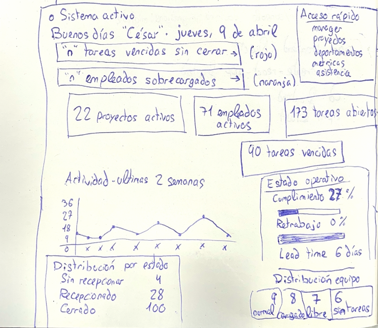

---

### Prototipo CU-01 – Autenticarse
Formulario de inicio de sesión con campos de usuario y contraseña, indicación de acceso restringido y mensajes de error contextuales.

---
### Prototipo CU-02 – Listar Empleados
Tabla paginada con barra de búsqueda por nombre, selector de departamento y opción de mostrar solo activos. Cada fila es navegable al resumen del empleado.

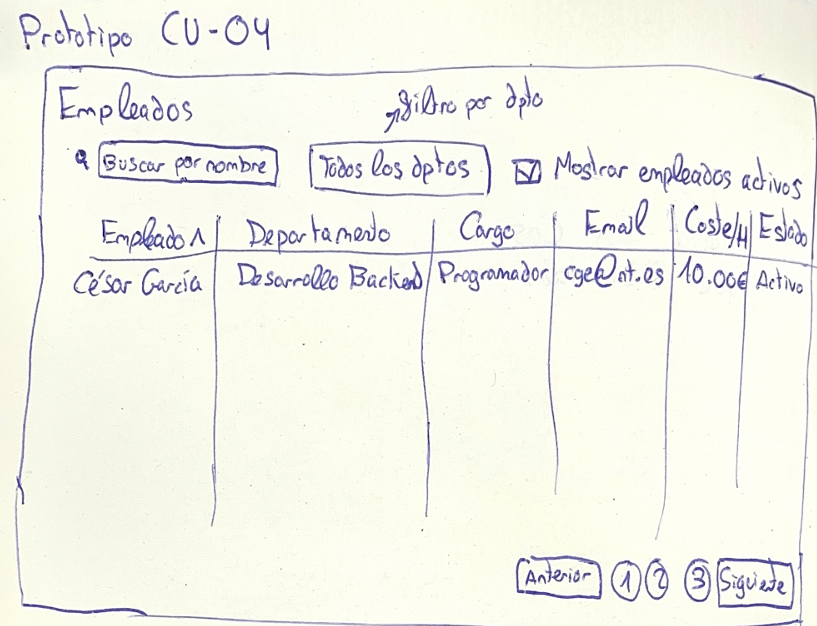

---

### Prototipo CU-03 – Resumen de Empleado
Panel individual con cabecera de perfil, indicadores principales y pestañas de tareas con filtro de fechas.

---
### Prototipo CU-04 – Listar Departamentos
Cuadrícula de tarjetas con el nombre del departamento y el responsable asignado. Cada tarjeta navega al resumen del departamento.

---
### Prototipo CU-05 – Resumen de Departamento
Panel de departamento con indicadores de distribución de carga, alerta para empleados sobrecargados y dos pestañas de visualización.

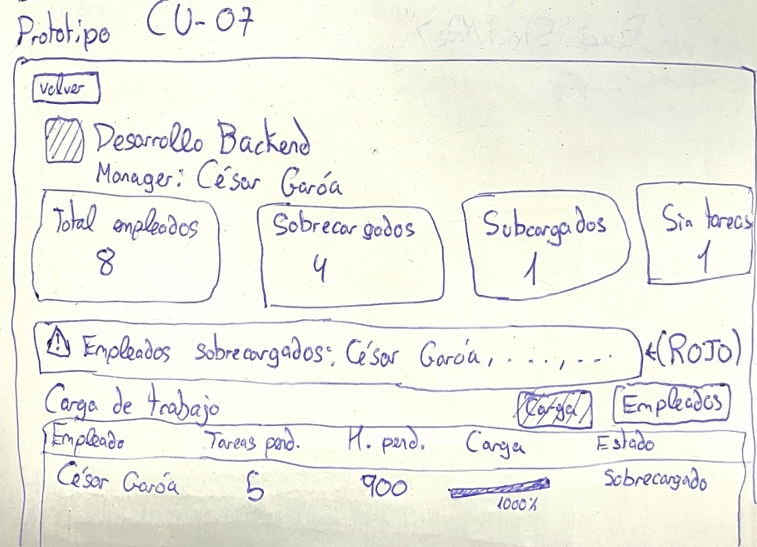

---
### Prototipo CU-06 – Listar Proyectos
Cuadrícula de tarjetas con nombre del proyecto, cliente asociado y código. Cada tarjeta navega al resumen del proyecto.

---
### Prototipo CU-07 – Resumen de Proyecto
Panel de proyecto con indicadores de eficiencia, riesgo y rentabilidad, gráfico comparativo de horas y pestañas de tareas y equipo.

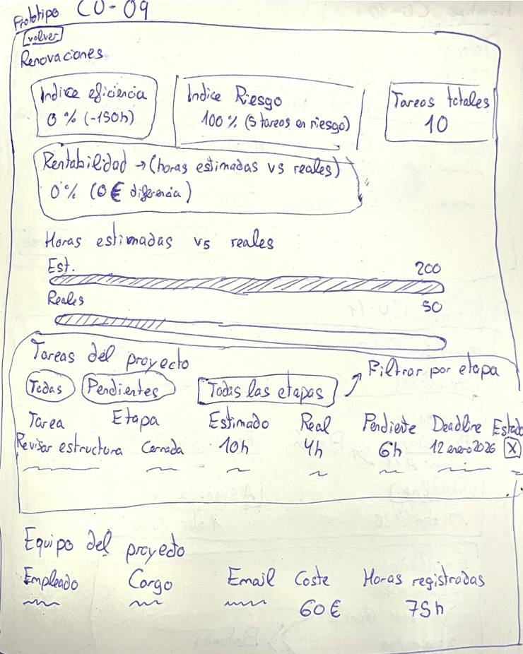

---
### Prototipo CU-08 – Listar Tareas
Tabla paginada con barra de filtros combinables: estado, etapa, proyecto, rango de fechas y opción de mostrar solo tareas principales.

---
### Prototipo CU-09 – Detalle de Tarea
Ficha de tarea con secciones de información general, personas, horas con barra de progreso y lista de subtareas.

---
### Prototipo P6 – Métricas Operativas (CU-10 a CU-20)
Página de métricas con cuadrícula de tarjetas a la izquierda y panel de detalle de la métrica seleccionada a la derecha. Panel de filtros en la parte superior.

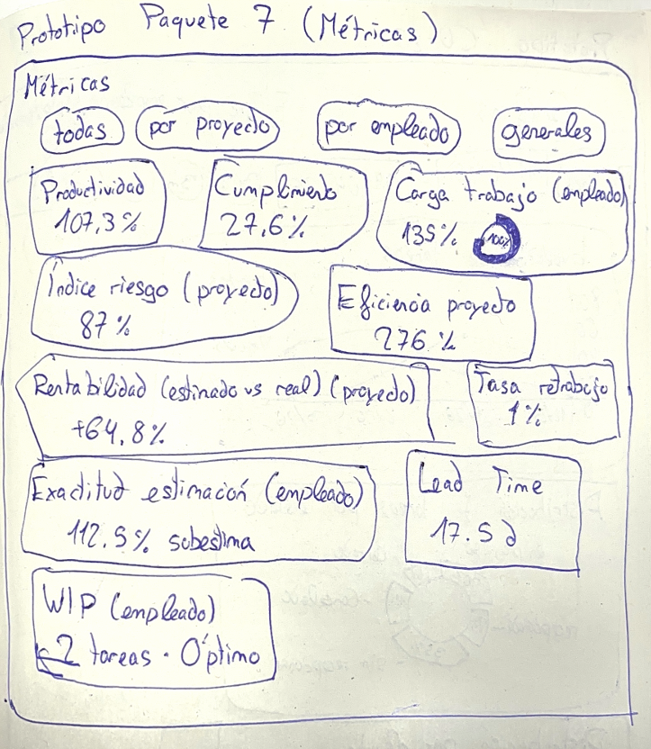

---
### Prototipo CU-21 – Gráficos Analíticos
Página de gráficos con barra de filtros y cuadrícula de visualizaciones: evolución temporal, distribución por estado y horas por cliente.

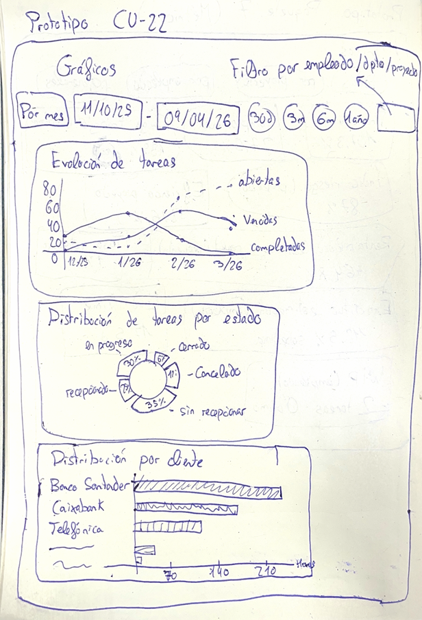

---
### Prototipo CU-22 – Asistencia vs Imputaciones
Página de asistencia con selector de modo de vista, filtros de fecha y departamento, indicadores globales, gráfico comparativo y tabla de empleados con semáforo de cobertura.

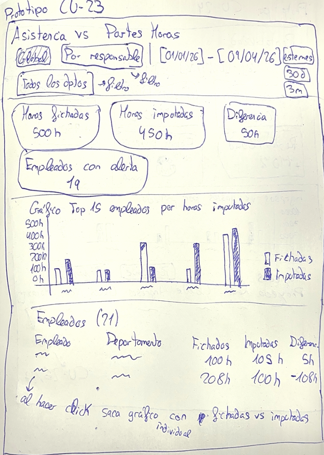

---
### Prototipo CU-23 – Rentabilidad Financiera
Página de rentabilidad con filtros de fecha y modo de análisis, indicadores financieros, gráfico comparativo y pestañas por proyecto y por cliente con opción de desglose detallado.

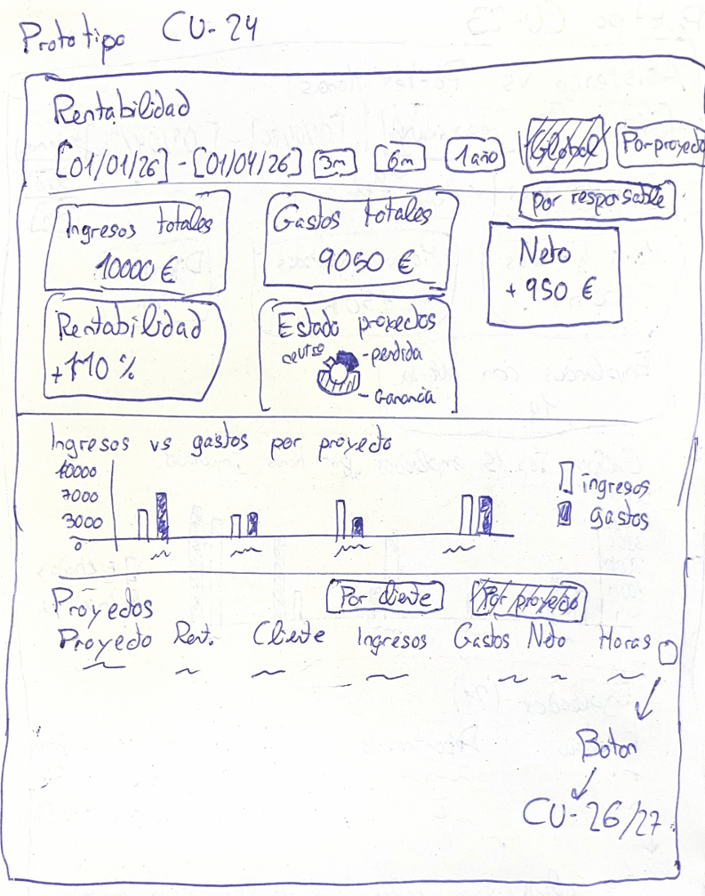

---
### Prototipo CU-24/CU-25 – Líneas Analíticas por Proyecto/Cliente
Panel de desglose accesible desde CU-23 con dos tablas paralelas de ingresos y gastos individuales.

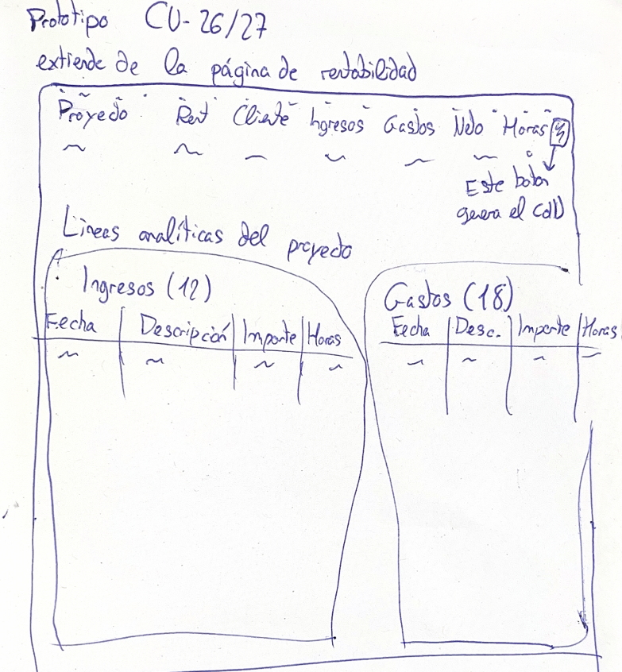

---
### Prototipo CU-26 – Búsqueda Global
Página de búsqueda con campo prominente, botones de filtro por tipo de entidad y resultados en forma de tarjetas navegables.

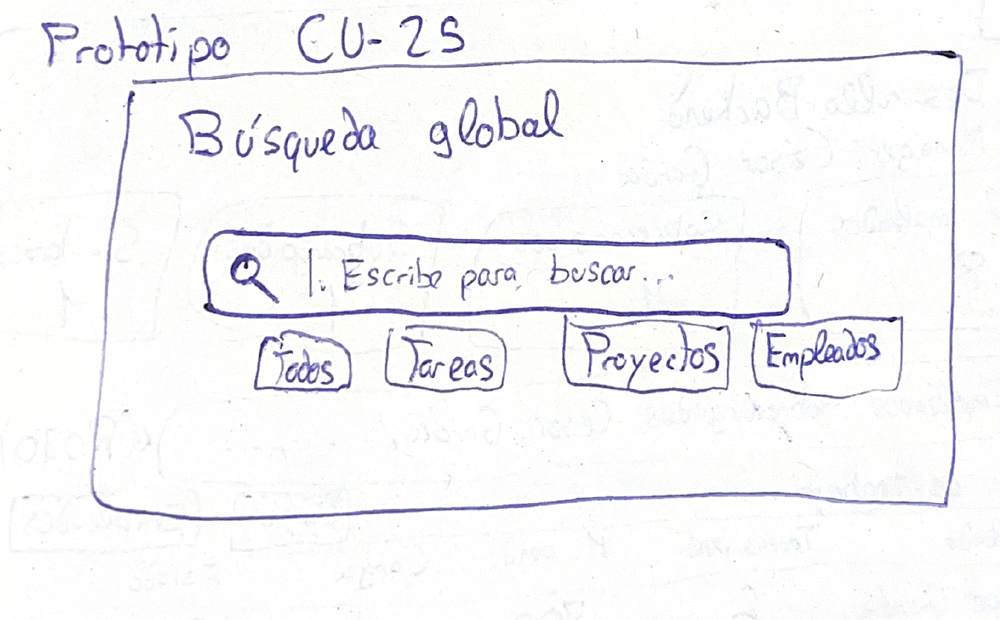

---
### Prototipo CU-28 – Consultar Carga del Equipo
Panel de supervisión con cinco tarjetas numéricas clicables (total, sobrecargado, normal,
subcargado, sin tareas), gráfico de barras de distribución por estado, panel de empleados
más cargados y — al hacer click en una tarjeta — listado paginado de empleados filtrados
por ese estado con su porcentaje de carga y horas pendientes.
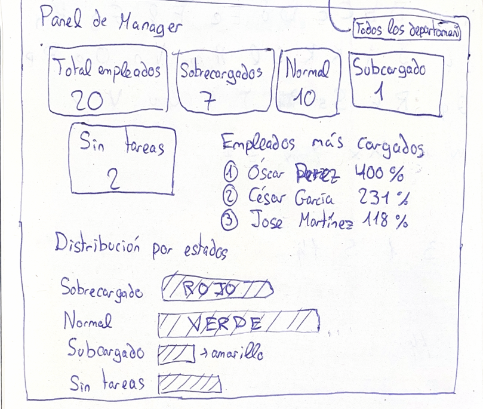

---

## 5. Estructurar el Modelo de Casos de Uso

### 5.1 Diagrama de Contexto – Director

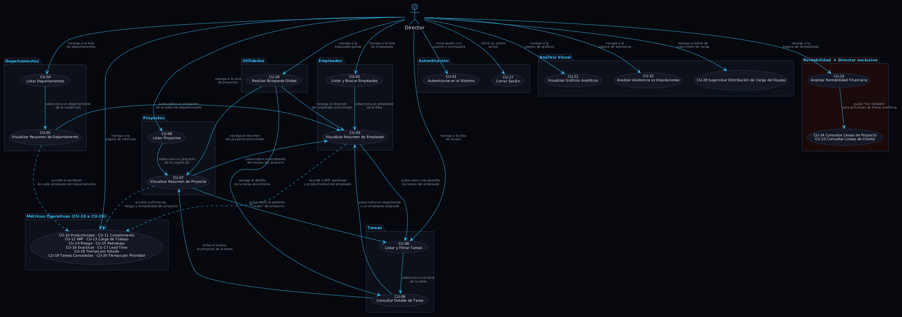

El Director tiene acceso a todos los casos de uso sin restricciones de ámbito. Es el único actor con acceso al módulo de rentabilidad financiera (CU-23, CU-24 y CU-25).

---

### 5.2 Diagrama de Contexto – Responsable

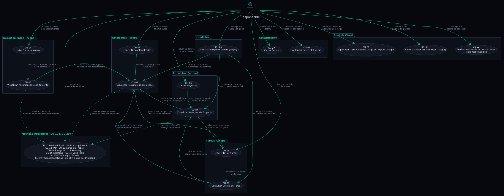

El Responsable tiene acceso a la mayoría de los casos de uso, pero con datos filtrados automáticamente a su ámbito organizativo (empleados, departamentos y proyectos bajo su responsabilidad).

---

### 5.3 Relaciones include / extend
 
#### 1. Relaciones de Inclusión `<<include>>`
 
Todos los casos de uso del sistema (excepto CU-01 Autenticarse)
requieren sesión autenticada activa. La relación `<<include>>` hacia
CU-01 se considera implícita en toda la arquitectura y **no se
representa individualmente** en los diagramas para evitar sobrecarga
visual. En el middleware se materializa mediante los guards
`require_manager_or_above` y `require_director`.
 
#### 2. Relaciones de Extensión `<<extend>>`
 
| Extensión | Desde → Hacia | Condición |
|---|---|---|
| Drill-down de rentabilidad | CU-13 → CU-14 | Actor pulsa "Ver detalles" sobre una fila de la tabla por proyecto (scope=proyecto) o por cliente (scope=cliente). |
| Guardar snapshot de métrica | CU-10 → CU-17 | Actor pulsa "Guardar snapshot" desde una vista calculada de métrica. |
| Guardar snapshot de gráfico | CU-11 → CU-17 | Actor pulsa "Guardar snapshot" sobre un gráfico concreto. |
| Guardar snapshot de rentabilidad ★ | CU-13 → CU-17 | Director pulsa "Guardar snapshot" sobre el resumen financiero. |
| Guardar snapshot de entidad | CU-03, CU-05, CU-07, CU-09 → CU-17 | Actor pulsa "Guardar snapshot" desde la ficha de una entidad. |
| Detalle de snapshot listada | CU-18 → CU-19 | Actor selecciona una fila en la tabla del visor. |
| Eliminación de snapshot | CU-19 → CU-20 | Actor pulsa "Eliminar" sobre la ficha abierta. |
 
#### Notas
 
- **CU-14** es el único CU cuya activación ocurre **exclusivamente** a
  través de `<<extend>>` (desde CU-13). No tiene ruta de entrada propia
  desde el menú principal.
- **CU-17** actúa como *extension point* universal para cualquier vista
  calculada. Su FA-01 (upsert) absorbe la semántica de actualización sin
  necesidad de un CU separado.
- La navegación lateral entre entidades (p. ej. CU-09 → CU-07) no es
  una relación `<<extend>>`: son transiciones de navegación declaradas
  en el diagrama de contexto, no dependencias funcionales entre CUs.
