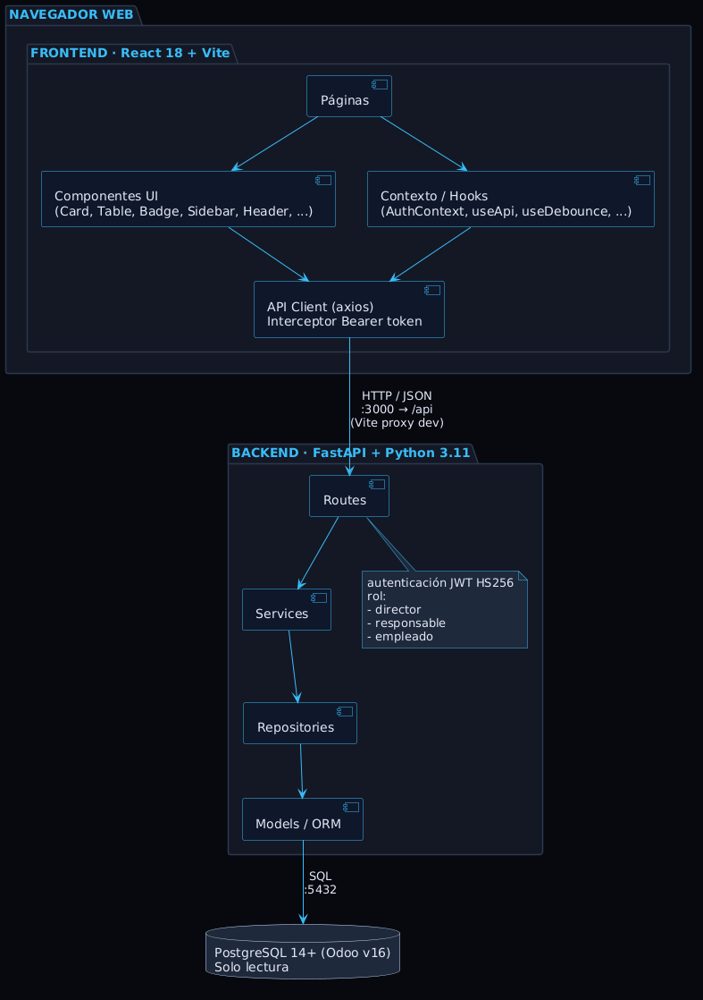

# Disciplina de Análisis

## Índice

1. [Análisis de la Arquitectura](#1-análisis-de-la-arquitectura)
   - 1.1 [Visión general del módulo](#11-visión-general-del-módulo)
   - 1.2 [Diagrama de arquitectura del sistema](#12-diagrama-de-arquitectura-del-sistema)
   - 1.3 [Restricción fundamental: solo lectura sobre Odoo](#13-restricción-fundamental-solo-lectura-sobre-odoo)
2. [Análisis de Casos de Uso](#2-análisis-de-casos-de-uso)
   - 2.1 [Actores](#21-actores)
   - 2.2 [Casos de uso del sistema](#22-casos-de-uso-del-sistema)
3. [Análisis de Clases](#3-análisis-de-clases)
   - 3.1 [Capas de la solución](#31-capas-de-la-solución)
   - 3.2 [Identificación de clases de análisis](#32-identificación-de-clases-de-análisis)
   - 3.3 [Relaciones entre clases del dominio](#33-relaciones-entre-clases-del-dominio)
4. [Análisis de Paquetes](#4-análisis-de-paquetes)
   - 4.1 [Estructura de paquetes del backend](#41-estructura-de-paquetes-del-backend)
   - 4.2 [Justificación de la estructura](#42-justificación-de-la-estructura)
   - 4.3 [Paquetes del frontend principal y del visor](#43-paquetes-del-frontend-principal-y-del-visor)


---

## 1. Análisis de la Arquitectura

### 1.1 Visión general del módulo

Netkia Analytics es un módulo externo de analítica construido sobre Odoo v16 Enterprise. Consta de **tres capas perfectamente desacopladas** y dos bases de datos (la relacional del ERP y la documental de capturas) que se consultan/modifican exclusivamente a través del backend:

- **Backend único** en FastAPI y Python, que accede al ERP a través de su base relacional en **solo lectura** y persiste las capturas históricas en una base documental independiente en modo lectura/escritura.
- **Frontend principal** en React (puerto 3000), que calcula todos los paneles en tiempo real sobre los datos del ERP y permite *generar* capturas desde cualquier vista calculada (CU-17).
- **Visor de capturas** en React (puerto 3001), aplicación independiente de solo lectura que lista, visualiza y elimina capturas (CU-18, CU-19, CU-20). Reutiliza el mismo esquema de autenticación que el frontend principal.

La separación entre los dos frontends es intencional: el principal resuelve el caso de uso *operativo* (decisiones hoy sobre datos vivos); el visor resuelve el caso de uso *histórico* (consultar el estado de un panel en un día pasado).


### 1.2 Diagrama de arquitectura del sistema

El diagrama de componentes muestra la arquitectura física desplegada: el frontend principal y el visor se comunican con el mismo backend a través de HTTP; el backend accede a la base de datos del ERP en modo solo lectura y, adicionalmente, a la base documental para las colecciones de capturas en modo lectura/escritura. El backend se organiza en capas (rutas, servicios, repositorios y modelos) que siguen principios de separación de responsabilidades y una única razón para cambiar.



### 1.3 Restricción fundamental: solo lectura sobre Odoo

El acceso exclusivo de lectura a la base de datos del ERP determina varias decisiones de arquitectura: no se utilizan patrones de escritura ni transacciones de modificación sobre la base relacional; todos los modelos de datos mapean tablas existentes sin añadir columnas; y la lógica del módulo operativo se concentra en optimizar consultas y calcular métricas, no en persistir estado propio.

La única excepción a esta restricción es el subsistema de capturas, que persiste sus propios documentos en la base documental. Esa base queda por completo fuera del espacio de Odoo: no existe integridad referencial real entre ambas, y la correspondencia entre una captura de entidad y la entidad operativa que retrata se mantiene de forma lógica mediante un campo de tipo y un identificador. De este modo, la restricción de solo lectura sobre el ERP se preserva íntegramente y el almacenamiento de capturas queda encapsulado en un subsistema independiente.

---

## 2. Análisis de Casos de Uso

Esta sección describe qué sucede en cada caso de uso desde el punto de vista del actor. Se identifican los artefactos reales que participan en cada paso del flujo principal, y se documenta el estado devuelto por el sistema al finalizar el caso de uso. Finalmente, se incluyen notas de análisis sobre decisiones arquitectónicas relevantes para cada caso.

### CU-02 — Listar empleados

#### Participantes del modelo

| Estereotipo RUP | Artefacto real | Responsabilidad |
|---|---|---|
| **Modelo (Entidad)** | `app/models/employee.py → Employee` | Mapea `hr_employee` |
| **Modelo (Entidad)** | `app/models/department.py → Department` | Mapea `hr_department` (JOIN para obtener nombre) |
| **Esquema de salida** | `app/schemas/employee.py → EmployeeDetail` | Contrato JSON del empleado |
| **Esquema de salida** | `app/schemas/base.py → PaginatedResponse[EmployeeDetail]` | Envuelve la lista paginada |
| **Repositorio** | `app/repositories/employee.py → get_filtered_employees_query()` | Query SQLAlchemy filtrada y ordenada |
| **Servicio** | `app/services/employee_service.py → EmployeeService.list_employees()` | Aplica filtro de ámbito, delega al repo, llama a `paginate()` |
| **Controlador** | `app/routes/employee.py → GET /employees/` | Valida parámetros HTTP, inyecta `require_manager_or_above` |
| **Vista** | `frontend/src/pages/Employees.jsx` | Tabla paginada con filtros de nombre, departamento y estado activo |
| **API frontend** | `frontend/src/api/employees.js → getEmployees(params)` | Axios GET `/api/employees/` |

### Estado devuelto

```json
{
  "items": [{ "id": 1, "name": "...", "department_name": "...",
              "job_title": "...", "work_email": "...",
              "hourly_cost": 35.0, "active": true }],
  "total": 48,
  "page": 1,
  "page_size": 25,
  "total_pages": 2
}
```

---

## CU-03 — Ver resumen de empleado

### Participantes del modelo

| Estereotipo RUP | Artefacto real | Responsabilidad |
|---|---|---|
| **Modelo** | `Employee`, `Task`, `TaskStage`, `Timesheet`, `TaskAssignment`, `ResUsers` | Datos del empleado y sus tareas |
| **Esquema de salida** | `EmployeeSummaryResponse`, `WorkloadResponse`, `WIPResponse`, `ProductivityResponse`, `EmployeeQuickStats` | Contrato JSON compuesto del resumen |
| **Repositorio** | `employee.py → get_employee_by_id()` | Ficha básica |
| **Repositorio** | `metrics/workload.py → get_assigned_open_tasks(), get_assigned_closed_tasks(), get_pending_hours_per_employee()` | Datos de carga de trabajo |
| **Repositorio** | `metrics/wip.py → count_open_assigned_tasks()` | WIP del empleado |
| **Repositorio** | `metrics/productivity.py → get_completed_tasks_with_hours()` | Productividad 30 d |
| **Repositorio** | `timesheet.py → worked_hours_subq()` | Subquery reutilizable de horas trabajadas |
| **Servicio** | `WorkloadService.calculate()` | Calcula % de carga, estado y listas de tareas |
| **Servicio** | `WIPService.calculate()` | Cuenta tareas abiertas en paralelo |
| **Servicio** | `ProductivityService.calculate()` | Calcula productividad media últimos 30 d |
| **Servicio** | `DashboardService.get_employee_summary()` | **Orquesta** los tres servicios anteriores |
| **Controlador** | `employee.router → GET /employees/{id}` | Devuelve ficha básica; verifica ámbito |
| **Controlador** | `dashboards.router → GET /dashboards/summary/employee/{id}` | Devuelve el resumen compuesto |
| **Vista** | `EmployeeDetail.jsx` | Cabecera, KPIs, tabla de tareas con tabs |
| **API frontend** | `getEmployee(id)`, `getEmployeeSummary(id)`, `getTasks({employee_id, status})` | Tres llamadas paralelas/secuenciales |

### Estado devuelto

`GET /employees/{id}` → `EmployeeDetail`

`GET /dashboards/summary/employee/{id}` →
```json
{
  "employee_id": 5,
  "workload": { "workload_percentage": 87.5, "pending_hours": 35.0,
                "available_hours": 40, "status": "normal",
                "total_pending_tasks": 7, "total_completed_tasks": 12,
                "pending_tasks": [...], "completed_tasks": [...] },
  "wip": { "wip_count": 3, "status": "optimo", "recommendation": "..." },
  "productivity_last_30_days": { "average_productivity": 94.2, "total_tasks": 12, "tasks": [...] },
  "quick_stats": { "workload_status": "normal", "pending_hours": 35.0,
                   "pending_tasks": 7, "completed_last_30_days": 12,
                   "wip_count": 3, "avg_productivity": 94.2 }
}
```

---

## CU-04 — Listar departamentos

### Participantes del modelo

| Estereotipo RUP | Artefacto real | Responsabilidad |
|---|---|---|
| **Modelo** | `app/models/department.py → Department` | Mapea `hr_department`; incluye auto-referencia `parent` y relación `manager` |
| **Modelo** | `app/models/employee.py → Employee` | JOIN para obtener el nombre del manager |
| **Esquema de salida** | `app/schemas/department.py → DepartmentDetail` | Contrato JSON del departamento |
| **Esquema de salida** | `PaginatedResponse[DepartmentDetail]` | Lista paginada |
| **Repositorio** | `app/repositories/department.py → get_filtered_departments_query()` | Query filtrada por búsqueda y ámbito |
| **Servicio** | `app/services/department_service.py → DepartmentService.list_departments()` | Aplica filtro de ámbito (`cu.department_ids`), delega al repo, pagina, serializa con `_to_detail()` |
| **Controlador** | `app/routes/department.py → GET /departments/` | Valida params, guard `require_manager_or_above` |
| **Vista** | `frontend/src/pages/Departments.jsx` | Grid de cards, cada una navega al detalle |
| **API frontend** | `frontend/src/api/departments.js → getDepartments()` | Axios GET `/api/departments/` |

### Estado devuelto

```json
{
  "items": [
    { "id": 3, "name": "Desarrollo", "complete_name": "Netkia / Desarrollo",
      "manager_id": 7, "manager_name": "Ana García", "parent_id": 1 }
  ],
  "total": 6,
  "page": 1,
  "page_size": 50,
  "total_pages": 1
}
```

---

## CU-08 — Listar tareas

### Participantes del modelo

| Estereotipo RUP | Artefacto real | Responsabilidad |
|---|---|---|
| **Modelo** | `Task`, `TaskStage`, `Project`, `Employee`, `TaskAssignment` | Tareas y sus relaciones |
| **Modelo** | `Timesheet` (vía subquery) | Horas reales por tarea |
| **Esquema de salida** | `TaskResponse`, `PendingTaskItem`, `CompletedTaskItem`, `AssignedTaskItem` | Cuatro variantes según el modo de filtrado |
| **Esquema de salida** | `PaginatedResponse` | Envoltorio de paginación |
| **Repositorio** | `app/repositories/task.py → build_filtered_query()` | Query central con 10+ filtros combinables; maneja `root_only`, `status`, `employee_id`, `department_id`, fechas y búsqueda |
| **Repositorio** | `app/repositories/timesheet.py → get_worked_hours_batch(task_ids)` | Obtiene horas en un solo query para toda la página |
| **Repositorio** | `app/repositories/task.py → open_stage_ids_subq() / closed_stage_ids_subq()` | Subqueries reutilizables para filtrar por estado de etapa |
| **Servicio** | `app/services/task_service.py → TaskService.filter_tasks()` | Aplica restricciones de ámbito, selecciona el serializador correcto (`_to_pending`, `_to_completed`, `_to_assigned`) según el modo |
| **Controlador** | `app/routes/task.py → GET /tasks/filter` | Valida todos los query-params; guard `require_manager_or_above` |
| **Vista** | `frontend/src/pages/Tasks.jsx` | Tabla paginada con múltiples filtros (estado, etapa, proyecto, fechas, empleado, root_only) |
| **API frontend** | `frontend/src/api/tasks.js → getTasks(params)` | Axios GET `/api/tasks/filter` |

### Estado devuelto (modo general, sin employee_id)

```json
{
  "items": [
    { "id": 42, "name": "Diseñar API REST", "project_id": 3,
      "parent_id": null, "planned_hours": 16.0, "effective_hours": 14.5,
      "date_deadline": "2025-06-30", "is_closed": false,
      "stage_name": "En progreso", "subtasks": [] }
  ],
  "total": 130,
  "page": 1,
  "page_size": 25,
  "total_pages": 6
}
```

### Modo con `employee_id + status=pending` → `PendingTaskItem`

```json
{ "id": 42, "name": "...", "stage_name": "En progreso",
  "planned_hours": 16.0, "worked_hours": 14.5,
  "pending_hours": 1.5, "date_deadline": "2025-06-30",
  "is_overdue": false }
```

---

## CU-13 — Consultar rentabilidad financiera ★ (Director exclusivo)

### Participantes del modelo

| Estereotipo RUP | Artefacto real | Responsabilidad |
|---|---|---|
| **Modelo** | `app/models/timesheet.py → Timesheet` | `account_analytic_line`; contiene `amount` (importe, positivo=ingreso, negativo=gasto) y `unit_amount` (horas) |
| **Modelo** | `app/models/project.py → Project` | Metadatos del proyecto (nombre JSONB, cliente) |
| **Modelo** | `app/models/employee.py → Employee` | Nombre del responsable |
| **Modelo** | `app/models/partner.py → Partner` | Nombre del cliente |
| **Repositorio** | `app/repositories/metrics/rentability.py` | `get_profitability_by_project()`, `get_global_totals()`, `get_project_meta()`, `get_manager_name()`, `get_all_managers()`, `get_account_analytic_lines()`, `get_client_analytic_lines()` |
| **Servicio** | `app/services/metrics/rentability_service.py → RentabilityService` | `get_summary()`, `get_per_project()`, `get_per_client()`, `get_by_manager()`, `get_project_lines()`, `get_client_lines()` |
| **Controlador** | `app/routes/metrics.py` (endpoints `/metrics/profitability/*`) | Todos con guard **`require_director`** — 403 para cualquier otro rol |
| **Vista** | `frontend/src/pages/Rentability.jsx` | Panel multi-modo (global, por proyecto, por responsable); gráficos de barras, pie de estados, tabla de proyectos/clientes, panel de líneas analíticas |
| **API frontend** | `api/metrics.js`: `getProfitabilitySummary`, `getProfitabilityPerProject`, `getProfitabilityPerClient`, `getProfitabilityByManager`, `getProjectAnalyticLines`, `getClientAnalyticLines` | Seis funciones Axios para los seis sub-modos |

### Estado devuelto por sub-modo

**`GET /metrics/profitability/summary`**
```json
{ "income": 125000.0, "expense": -98000.0, "net": 27000.0,
  "total_hours": 3200.0, "profitability_pct": 21.6, "status": "ganancia",
  "projects_summary": { "ganancia": 8, "neutro": 2, "perdida": 1, "total": 11 } }
```

**`GET /metrics/profitability/per-project`** → lista de proyectos con
`income`, `expense`, `net`, `profitability_pct`, `status`, `client_name`.

**`GET /metrics/profitability/per-project/{id}/lines`** →
```json
{ "incomes": [{ "id":1, "date":"2025-03-01", "name":"Consultoría", "amount":5000.0, "hours":40.0 }],
  "expenses": [{ "id":2, "date":"2025-03-05", "name":"Coste empleado", "amount":-3200.0, "hours":80.0 }] }
```

---

## CU-17 — Guardar snapshot

### Participantes del modelo

| Estereotipo RUP | Artefacto real | Responsabilidad |
|---|---|---|
| **Modelo (documental)** | Colecciones MongoDB: `metric_snapshots`, `chart_snapshots`, `entity_snapshots` | Documentos con índices únicos sobre `(metric_name, params_hash, snapshot_date)` etc. |
| **Esquema de entrada** | `MetricSnapshotCreate`, `ChartSnapshotCreate`, `EntitySnapshotCreate` (Pydantic) | Validan `metric_name/chart_name/entity_type`, `params`, `data` |
| **Esquema de salida** | `UpsertResult` | `{ id, created: bool, snapshot_date }` |
| **Repositorio** | `app/repositories/snapshot.py → upsert_metric_snapshot() / upsert_chart_snapshot() / upsert_entity_snapshot()` | Calcula `params_hash = SHA-256[:16](json.dumps(params))`, fecha (`_today()`), construye el `match` único y ejecuta `update_one(match, $set+$setOnInsert, upsert=True)` |
| **Servicio** | `app/services/snapshot.py → SnapshotService.save_metric/chart/entity()` | Construye el objeto `actor` desde `CurrentUser`; delega al repo |
| **Controlador** | `app/routes/snapshots.py` → POST /snapshots/metrics|charts|entities` | Guard `require_manager_or_above`; deserializa body; llama al servicio |
| **Componente UI** | `frontend/src/components/ui/SaveSnapshotButton.jsx` | Botón integrado en cualquier página calculada; gestiona estados `idle → saving → saved/updated/error` |
| **API frontend** | `frontend/src/api/snapshots.js → saveMetricSnapshot/saveChartSnapshot/saveEntitySnapshot` | Axios POST a cada colección |

### Estado devuelto

```json
{ "id": "6845a3f2e1b09c4d78a12345", "created": true, "snapshot_date": "2025-05-12" }
```
Si ya existe una snapshot para ese mismo día y parámetros: `"created": false` (actualización).


---

## CU-19 — Consultar detalle de snapshot

### Participantes del modelo

| Estereotipo RUP | Artefacto real | Responsabilidad |
|---|---|---|
| **Modelo (documental)** | Colección MongoDB correspondiente al tipo (`metric_snapshots`, `chart_snapshots` o `entity_snapshots`) | Documento único recuperado por `_id` (ObjectId) |
| **Esquema de salida** | `MetricSnapshotOut`, `ChartSnapshotOut`, `EntitySnapshotOut` (Pydantic) | Contratos de respuesta con campos `id`, `*_name`, `params`, `data`, `created_at/by`, `updated_at/by` |
| **Repositorio** | `app/repositories/snapshot.py → get_metric_snapshot(id) / get_chart_snapshot(id) / get_entity_snapshot(id)` | `coll.find_one({"_id": _oid(id_str)})` → `_serialize()` convierte `_id → id` (string) |
| **Servicio** | `app/services/snapshot.py → SnapshotService.get_metric/chart/entity(id)` | Llama al repo; si `None` lanza `HTTPException(404)` |
| **Controlador** | `app/routes/snapshots.py → GET /snapshots/metrics/{id} | charts/{id} | entities/{id}` | Guard `require_manager_or_above` |
| **Vista** | `frontend2/src/pages/SnapshotDetail.jsx` | Cabecera, sidebar de metadatos, renderizador visual específico por subtipo, toggle JSON crudo |
| **Renderizadores** | Componentes internos de `SnapshotDetail.jsx`: `MetricVisualizer`, `ChartVisualizer`, `EntityVisualizer` | Interpretan `snap.data` y renderizan gráficos Recharts, fichas de entidad, barras de progreso |
| **API frontend (visor)** | `frontend2/src/api/snapshots.js → getMetric(id) / getChart(id) / getEntity(id)` | Axios GET al endpoint correspondiente |

### Estado devuelto (ejemplo: métrica de productividad)

```json
{
  "id": "6845a3f2e1b09c4d78a12345",
  "metric_name": "productivity",
  "params": { "employee_id": 5 },
  "params_hash": "a3f7b2c1",
  "snapshot_date": "2025-05-12",
  "data": {
    "average_productivity": 94.2,
    "total_tasks": 12,
    "tasks": [{ "task_id": 42, "task_name": "...", "planned_hours": 16.0,
                "actual_hours": 14.5, "productivity_pct": 110.3 }]
  },
  "created_at": "2025-05-12T10:23:11+02:00",
  "created_by": { "user_id": 3, "employee_id": 5, "employee_name": "Ana García", "role": "director" },
  "updated_at": "2025-05-12T10:23:11+02:00",
  "updated_by": { "user_id": 3, "employee_id": 5, "employee_name": "Ana García", "role": "director" }
}
```

---

## Tabla resumen de trazabilidad

| CU | Vista React | API Frontend | Controlador FastAPI | Servicio | Repositorio principal | Modelos SQL | Colección MongoDB | Guard |
|----|------------|-------------|--------------------|---------|-----------------------|-------------|------------------|----|
| **CU-02** | `Employees.jsx` | `employees.js → getEmployees` | `employee.router GET /employees/` | `EmployeeService.list_employees` | `employee.py → get_filtered_employees_query` | `Employee`, `Department` | — | `require_manager_or_above` |
| **CU-03** | `EmployeeDetail.jsx` | `getEmployee` + `getEmployeeSummary` + `getTasks` | `employee.router` + `dashboards.router` | `EmployeeService` + `DashboardService` (orquesta `WorkloadService`, `WIPService`, `ProductivityService`) | `employee`, `workload`, `wip`, `productivity` repos | `Employee`, `Task`, `Timesheet`, `TaskAssignment`, `TaskStage` | — | `require_manager_or_above` |
| **CU-04** | `Departments.jsx` | `departments.js → getDepartments` | `department.router GET /departments/` | `DepartmentService.list_departments` | `department.py → get_filtered_departments_query` | `Department`, `Employee` | — | `require_manager_or_above` |
| **CU-08** | `Tasks.jsx` | `tasks.js → getTasks` | `task.router GET /tasks/filter` | `TaskService.filter_tasks` | `task.py → build_filtered_query` + `timesheet.py → get_worked_hours_batch` | `Task`, `TaskStage`, `Project`, `Employee`, `TaskAssignment`, `Timesheet` | — | `require_manager_or_above` |
| **CU-13** | `Rentability.jsx` | `metrics.js → getProfitability*` | `metrics.router GET /metrics/profitability/*` | `RentabilityService` | `rentability.py → get_profitability_by_project / get_global_totals / ...` | `Timesheet`, `Project`, `Employee`, `Partner` | — | **`require_director`** |
| **CU-17** | `SaveSnapshotButton.jsx` (componente) | `snapshots.js → saveMetric/Chart/EntitySnapshot` | `snapshots.router POST /snapshots/{colección}` | `SnapshotService.save_metric/chart/entity` | `snapshot.py → upsert_*_snapshot` | — | `metric_snapshots` / `chart_snapshots` / `entity_snapshots` | `require_manager_or_above` |
| **CU-19** | `SnapshotDetail.jsx` (frontend2) | `snapshots.js → getMetric/Chart/Entity` | `snapshots.router GET /snapshots/{colección}/{id}` | `SnapshotService.get_metric/chart/entity` | `snapshot.py → get_*_snapshot` | — | (colección según tipo) | `require_manager_or_above` |

---

## 3. Análisis de Clases

### 3.1 Capas de la solución

La solución sigue una **arquitectura por capas** en el backend y dos aplicaciones independientes (frontend principal y visor) sobre el mismo backend. Las dependencias fluyen exclusivamente hacia abajo (nunca ascienden).

| Capa | Responsabilidad | Cambios por |
|------|-----------------|-------------|
| **Rutas** | Enrutamiento HTTP FastAPI | Nuevos endpoints, nueva interfaz HTTP |
| **Servicios** | Lógica de negocio, cálculos, orquestación | Reglas de negocio, fórmulas, algoritmos |
| **Repositorios** | Acceso a datos, queries SQL o MongoDB | Cambios en estructura de tablas Odoo o colecciones Mongo |
| **Modelos** | Mapeo de tablas Odoo con SQLAlchemy | Presencia/ausencia de columnas en Odoo |
| **Schemas** | Contratos JSON Pydantic (incluidos los de snapshot) | Nuevos campos en respuestas API |
| **Core** | Configuración, autenticación, conexiones a PostgreSQL y MongoDB | Cambios globales de configuración |
| **Utils** | Constantes y utilidades compartidas | Nuevas constantes, nuevos helpers |

Cada capa tiene **una única razón para cambiar** (Principio de Responsabilidad Única).
Además, el backend se conecta a dos bases de datos distintas: la relacional del ERP en modo solo lectura, y la documental de capturas en modo lectura/escritura. El acceso a ambas se encapsula en la capa de repositorios, que es la única que interactúa directamente con las bases de datos.
Aunque el subsistema de capturas persiste en una base de datos distinta, respeta la misma arquitectura: tiene su propia ruta, su servicio, su repositorio y su esquema de datos. No introduce un modelo ORM porque la base documental no requiere mapeo relacional; la serialización y deserialización de los documentos se realiza directamente a través del esquema correspondiente.

### 3.2 Identificación de clases de análisis

Siguiendo la metodología RUP, las clases se clasifican en tres estereotipos:

**Clases Modelo (Entidad) — tablas del ERP:**

| Clase | Tabla del ERP | Datos principales |
|---|---|---|
| Tarea | `project_task` | id, horas planificadas, cerrada, etapa, proyecto, responsable, fecha límite |
| Etapa | `project_task_type` | id, nombre, cerrada |
| Empleado | `hr_employee` | id, nombre, coste por hora, departamento, usuario |
| Departamento | `hr_department` | id, nombre, responsable, jerarquía |
| Proyecto | `project_project` | id, nombre, cliente, fecha de inicio |
| Parte de horas | `account_analytic_line` | id, cantidad, importe, tarea, empleado, fecha |
| Asistencia | `hr_attendance` | id, empleado, entrada, salida, horas trabajadas |
| Asignación de tarea | `project_task_user_rel` | tarea, usuario |
| Usuario | `res_users` | id, login |
| Cliente | `res_partner` | id, nombre |
| Mensaje de registro | `mail_message` | id, modelo, registro, fecha |
| Cambio registrado | `mail_tracking_value` | mensaje asociado, valor anterior, valor nuevo |

**Clases Modelo (Entidad) — colecciones documentales:**

| Clase | Colección | Datos principales |
|---|---|---|
| Captura de Métrica | colección de métricas | identificador, nombre de métrica, parámetros, fecha, datos, fechas de creación/actualización, autores |
| Captura de Gráfico | colección de gráficos | identificador, nombre de gráfico, parámetros, fecha, datos, fechas de creación/actualización, autores |
| Captura de Entidad | colección de entidades | identificador, tipo y id de entidad, fecha, datos, fechas de creación/actualización, autores |
| Autor de Captura | *referencia embebida* | id de usuario, id de empleado, nombre, rol |

**Clases Vista (Interfaz) — páginas de las aplicaciones:**

| Aplicación | Clase | Actor | CU asociados |
|---|---|---|---|
| Principal | `Login` | Ambos | CU-01 |
| Principal | `Overview` | Ambos | Panel de inicio |
| Principal | `Employees` / `EmployeeDetail` | Ambos | CU-02, CU-03 |
| Principal | `Departments` / `DepartmentDetail` | Ambos | CU-04, CU-05 |
| Principal | `Projects` / `ProjectDetail` | Ambos | CU-06, CU-07 |
| Principal | `Tasks` / `TaskDetail` | Ambos | CU-08, CU-09 |
| Principal | `Metrics` / `MetricDetail` | Ambos | CU-10, CU-22 a CU-32 |
| Principal | `Manager` | Ambos | CU-21 |
| Principal | `Attendance` | Ambos | CU-12 |
| Principal | `Rentability` | Director | CU-13, CU-14 |
| Principal | `Charts` | Ambos | CU-11 |
| Principal | `Search` | Ambos | CU-15 |
| Visor | `Login` | Ambos | CU-01 (reutiliza el mismo esquema) |
| Visor | `Home` | Ambos | Resumen global y atajo a las últimas capturas |
| Visor | `MetricSnapshots` | Ambos | CU-18 (colección de métricas) |
| Visor | `ChartSnapshots` | Ambos | CU-18 (colección de gráficos) |
| Visor | `EntitySnapshots` | Ambos | CU-18 (colección de entidades) |
| Visor | `SnapshotDetail` | Ambos | CU-19 y CU-20 |

**Clases Controlador — rutas del backend:**

| Clase | CU coordinados | Servicio al que delega |
|---|---|---|
| `auth.router` | CU-01, CU-16 | Servicio de autenticación y servicio de ámbito |
| `employee.router` | CU-02, CU-03 | Servicio de empleados |
| `department.router` | CU-04, CU-05 | Servicio de departamentos |
| `project.router` | CU-06, CU-07 | Servicio de proyectos |
| `task.router` | CU-08, CU-09 | Servicio de tareas |
| `metrics.router` | CU-10, CU-22 a CU-32, CU-12, CU-13, CU-14 | Servicios de métricas, asistencia, rentabilidad |
| `dashboards.router` | CU-03, CU-05, CU-07, CU-21 | Servicio de dashboards |
| `charts.router` | CU-11 | Servicio de gráficos |
| `search.router` | CU-15 | Servicio de búsqueda |
| `snapshots.router` | CU-17, CU-18, CU-19, CU-20 | Servicio de capturas |


### 3.3 Relaciones entre clases del dominio

| Relación | Tipo | Cardinalidad |
|---|---|---|
| Proyecto → Tarea | Composición | 1 a 0..* |
| Tarea → Etapa | Asociación | * a 1 |
| Tarea → Tarea | Auto-referencia (subtareas) | * a 0..1 |
| Empleado → Departamento | Agregación | * a 0..1 |
| Tarea → Empleado (responsable) | Asociación | * a 0..1 |
| Tarea ↔ Usuario | Asociación M:N a través de Asignación | * a * |
| Parte de horas → Tarea | Asociación | * a 0..1 |
| Parte de horas → Empleado | Asociación | * a 1 |
| Proyecto → Cliente | Asociación | * a 0..1 |
| Cambio registrado → Mensaje de registro | Asociación | * a 1 |
| Captura → Autor de Captura | Agregación (referencia embebida) | 1 a 0..1 (creación y actualización) |
| Captura de Entidad → Empleado / Departamento / Proyecto / Tarea | Referencia blanda mediante tipo e identificador | * a 1 |

La referencia blanda entre la captura de entidad y las entidades operativas del ERP es intencional: la base documental y la base relacional son independientes, por lo que no existe una clave foránea real. La unicidad diaria se garantiza mediante los índices únicos sobre la clave compuesta de cada colección.

---

## 4. Análisis de Paquetes

### 4.1 Estructura de paquetes del backend

El backend se distribuye en carpetas siguiendo el criterio de **cohesión funcional**: cada paquete agrupa módulos con la misma naturaleza de responsabilidad. La estructura relevante es:

```
app/
├── core/
│   ├── config.py        → Configuración por entorno
│   ├── database.py      → Conexión a la base relacional del ERP (solo lectura)
│   ├── mongo.py         → Cliente de la base documental (lectura/escritura)
│   └── security.py      → Generación y validación de sesiones + guards de rol
├── models/              → Clases del dominio operativo (una por entidad del ERP)
├── schemas/             → Contratos de entrada/salida del backend
│   └── snapshot.py      → Esquemas de las capturas de métrica, gráfico y entidad
├── repositories/
│   ├── employee.py      → Acceso al dominio de empleados
│   ├── project.py       → Acceso al dominio de proyectos
│   ├── department.py    → Acceso al dominio de departamentos
│   ├── task.py          → Acceso al dominio de tareas
│   ├── tracking.py      → Acceso al dominio de partes de horas
│   ├── attendance.py    → Acceso al dominio de fichajes
│   ├── snapshot.py      → Acceso a las tres colecciones documentales
│   └── metrics/         → Sub-paquete: una función por métrica operativa
├── services/
│   ├── metric/          → Implementaciones por métrica (CU-22 a CU-32)
│   ├── dashboard.py     → Composición para los resúmenes de entidad
│   ├── chart.py         → Datos para los gráficos analíticos
│   ├── search.py        → Búsqueda global
│   ├── auth.py          → Autenticación y construcción del ámbito
│   └── snapshot.py      → Orquestación del subsistema de capturas
├── routes/
│   ├── auth.py
│   ├── resources/       → Endpoints de las entidades operativas
│   ├── metrics/         → Endpoints de las métricas operativas (CU-10, CU-22 a CU-32)
│   ├── charts/          → Endpoints de los gráficos analíticos
│   ├── dashboards/      → Endpoints de los resúmenes y de rentabilidad
│   └── snapshots.py     → Endpoints para guardar, listar, consultar y eliminar capturas
└── utils/               → Paginación, traducción de nombres multilingües y validaciones de ámbito
```

### 4.2 Justificación de la estructura

**`core/`** agrupa todo lo que es infraestructura transversal: configuración, generación y validación de sesiones, pool de conexiones a la base del ERP y cliente a la base documental, y guardas de rol. Cambia solo cuando cambia la infraestructura, no el negocio. La adición del módulo de conexión documental respeta este criterio: aísla el cliente en un único punto, independiente del acceso a la base relacional.

**`models/`** contiene exclusivamente el mapeo sobre el dominio operativo del ERP. Ningún modelo ejecuta lógica; solo declara columnas y relaciones. No se añaden modelos para el subsistema de capturas porque la base documental no requiere tal mapeo: la serialización se delega a la capa de esquemas.

**`repositories/`** encapsula cada consulta como una función pura que recibe una sesión y devuelve datos crudos. El sub-paquete `repositories/metrics/` extiende esta idea con un submódulo por métrica (uno por cada CU del paquete P10), evitando que un único fichero acumule consultas heterogéneas. El repositorio de capturas es el único que no opera sobre la base relacional: ejecuta directamente operaciones de inserción, lectura, actualización, listado paginado y borrado sobre las tres colecciones documentales a través del cliente de infraestructura.

**`services/`** aplica las reglas de negocio sobre los datos recuperados por los repositorios. El sub-paquete `services/metrics/` sigue la misma granularidad que `repositories/metrics/`: una clase, una métrica, una razón de cambio. El servicio de capturas añade responsabilidades propias del subsistema: normalizar parámetros, calcular el resumen único que identifica a la captura, construir el autor a partir de la sesión del usuario, fijar la fecha y decidir entre insertar o actualizar (semántica de actualización diaria) según la existencia previa.

**`routes/`** actúa como capa de entrada HTTP. Las rutas no contienen lógica de negocio: validan parámetros, comprueban la autenticación y delegan en el servicio correspondiente. El sub-paquete `routes/metrics/` expone un endpoint por cada métrica operativa (CU-22 a CU-32) más el endpoint del catálogo (CU-10), siguiendo el principio OCP: añadir una nueva métrica implica añadir un único fichero nuevo sin modificar los existentes.

**`utils/`** recoge funciones reutilizables que no pertenecen a ningún dominio: paginación, extracción de nombres multilingües, ordenación de diccionarios y validaciones de rango de fechas.

### 4.3 Paquetes del frontend principal y del visor

Aunque el diseño de calidad recae principalmente sobre el backend, los frontends también siguen una estructura orientada a la separación de responsabilidades. El frontend principal y el visor son **dos aplicaciones independientes** que comparten contexto de autenticación pero no código de presentación.

**Frontend principal (`frontend/`):**

```
src/
├── api/            → Un módulo por dominio (empleados, tareas, métricas,gráficos, rentabilidad, capturas, búsqueda, autenticación)
├── components/     → Componentes reutilizables (Card, Table, KpiCard, Sidebar,botón de guardado de captura...)
├── context/        → Estado global de autenticación
├── hooks/          → Lógica reutilizable
├── pages/          → Una página por recurso o funcionalidad
├── styles/         → Variables CSS globales y tokens de diseño
└── utils/          → Formateadores y helpers
```

Todas las páginas calculadas (detalle de métrica, gráficos, rentabilidad y las fichas de entidad) integran el botón de guardado de captura, que llama al módulo de API correspondiente para disparar CU-17 desde el contexto actual de la vista.

**Visor de capturas:**

```
src/
├── api/
│   ├── auth.js             → Mismo contrato que el frontend principal
│   └── snapshots.js        → Lectura y borrado de las tres colecciones
├── components/             → Tabla paginada, filtros, panel expandible con el contenido
├── context/                → Contexto de autenticación reutilizado
├── pages/
│   ├── Login.jsx
│   ├── Home.jsx            → Resumen global más últimas capturas guardadas
│   ├── MetricSnapshots.jsx → Listado de capturas de métricas (CU-18)
│   ├── ChartSnapshots.jsx  → Listado de capturas de gráficos (CU-18)
│   ├── EntitySnapshots.jsx → Listado de capturas de entidades (CU-18)
│   └── SnapshotDetail.jsx  → Detalle reconstruido y eliminación (CU-19, CU-20)
├── renderers/
│   ├── MetricView.jsx      → Gauge, gráfico e indicadores según la métrica
│   ├── ChartView.jsx       → Gráfico interactivo según el tipo
│   └── EntityView.jsx      → Ficha con avatar, campos y barra de progreso
└── vite.config.js          → Puerto 3001, proxy al backend
```

El visor no duplica los componentes de cálculo del frontend principal: sus renderizadores operan exclusivamente sobre los datos guardados en la base documental, sin llamar a ningún endpoint de cálculo sobre el ERP. Este desacoplamiento entre cálculo y visualización garantiza que una captura mantenga su representación original aunque los cálculos del frontend principal evolucionen en el futuro.

---