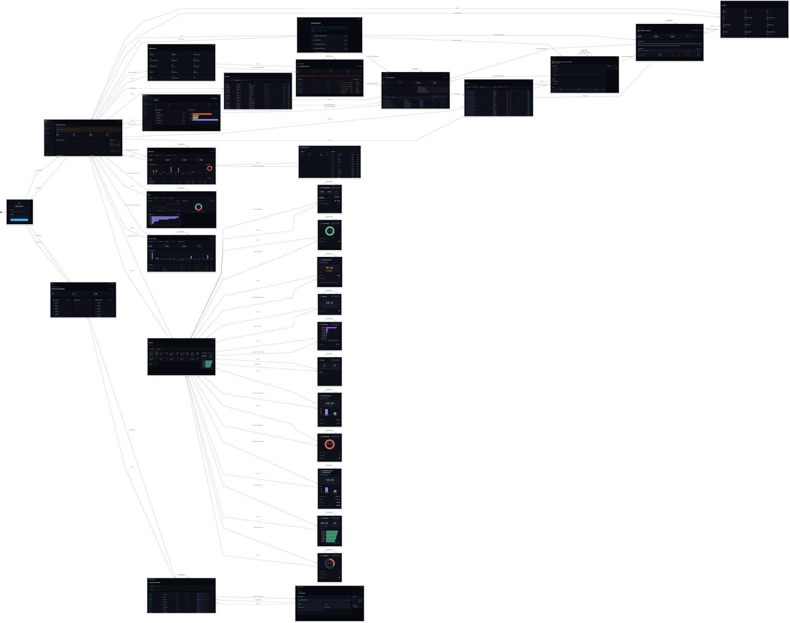

# Capítulo 4 — Implementación

Este capítulo documenta la implementación real del **Módulo de Análisis ERP**, detallando cómo cada caso de uso diseñado en el Capítulo 3 se traduce en componentes concretos del sistema. La documentación cubre la capa de rutas HTTP (FastAPI), la capa de servicios con la lógica de negocio, la capa de repositorios que accede a PostgreSQL (Odoo, solo lectura) y MongoDB (snapshots), y el frontend en React 18 + Vite.

---

## Diagrama general de navegación

El diagrama de estados del Capítulo 4 muestra el flujo real de la aplicación con capturas de pantalla reales de la interfaz embebidas en cada estado. Cada nodo representa una pantalla del sistema y cada flecha una acción del usuario que provoca la transición.

> El fuente PlantUML del diagrama está en [`diagramas/navegacion.puml`](./diagramas/navegacion.puml).

### Estructura del diagrama

El diagrama refleja la navegación completa del sistema dividida en paquetes funcionales:

| Paquete | Estados | Descripción |
|---|---|---|
| **Autenticación** | `NoAuth` → `Overview` | Inicio de sesión con JWT. El Responsable inicia también el visor de snapshots. |
| **P2 · Empleados** | `ListEmp`, `DetEmp` | Listado filtrable y ficha de resumen con KPIs y pestañas de tareas. |
| **P3 · Departamentos** | `ListDept`, `DetDept` | Listado y ficha con distribución de carga del equipo. |
| **P4 · Proyectos** | `ListProy`, `DetProy` | Listado y ficha con eficiencia, riesgo y rentabilidad del proyecto. |
| **P5 · Tareas** | `ListTarea`, `DetTarea` | Listado polimórfico y detalle con subtareas y horas. |
| **P6 · Métricas** | `Metricas` + 11 estados | Catálogo de métricas y cada métrica individual con guardar snapshot. |
| **P7 · Rentabilidad ★** | `Rentabilidad`, `Lineas` | Exclusivo Director. Resumen financiero y líneas analíticas. |
| **P8 · Utilidades** | `Graficos`, `Asistencia`, `Manager`, `Busqueda` | Gráficos analíticos, asistencia vs imputaciones, distribución de equipo y búsqueda global. |
| **P9 · Snapshots** | `VisorInicial`, `Visor`, `DetSnap` | Visor independiente (puerto 3001) para consultar y eliminar snapshots. |

---

## Casos de uso implementados

A continuación se lista cada caso de uso documentado en este capítulo con su fichero de especificación correspondiente.

> Cada fichero de especificación incluye un apartado **`## Implementación`** al final con los fragmentos de código más relevantes de las tres capas del sistema (Routes → Service → Repository), comentados para facilitar su lectura en la memoria.

### P2 · Gestión de empleados

| CU | Nombre | Especificación |
|---|---|---|
| **CU-02** | Listar y Buscar Empleados | [docs/CU-02.md](./docs/CU-02.md) |
| **CU-03** | Ver Resumen de Empleado | [docs/CU-03.md](./docs/CU-03.md) |

### P5 · Gestión de tareas

| CU | Nombre | Especificación |
|---|---|---|
| **CU-08** | Listar Tareas | [docs/CU-08.md](./docs/CU-08.md) |

### P6 · Métricas operativas

| CU | Nombre | Especificación |
|---|---|---|
| **CU-10** | Consultar Catálogo de Métricas | [docs/CU-10.md](./docs/CU-10.md) |
| **CU-22** | Consultar Productividad | [docs/CU-22.md](./docs/CU-22.md) |

### P7 · Rentabilidad financiera ★ Director

| CU | Nombre | Especificación |
|---|---|---|
| **CU-13** | Consultar Rentabilidad Financiera | [docs/CU-13.md](./docs/CU-13.md) |

### P9 · Snapshots

| CU | Nombre | Especificación |
|---|---|---|
| **CU-17** | Guardar Snapshot (upsert diario) | [docs/CU-17.md](./docs/CU-17.md) |
| **CU-19** | Consultar Detalle de Snapshot | [docs/CU-19.md](./docs/CU-19.md) |

