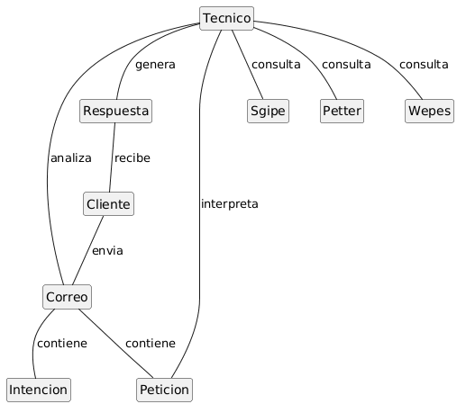

# Modelo de Dominio
## Diagrama de Clases 
| Diagrama | Código Fuente |
|----------|---------------|
||[Ver Código del Diagrama de Clases](./MdD/DdC/codigo/DdC.puml)

El diagrama de clases representa el funcionamiento actual del sistema de gestión del buzón. En él, un cliente envía un correo electrónico, que contiene una intención y, en muchos casos, una petición.

El técnico es el encargado de analizar el correo recibido, identificar su contenido e interpretar la petición. A partir de esta, consulta diferentes aplicaciones internas como Sgipe, Petter y Wepes para obtener la información necesaria.

Finalmente, el técnico genera una respuesta, que es enviada al cliente como contestación a su solicitud.