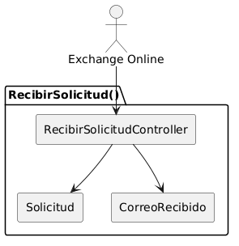
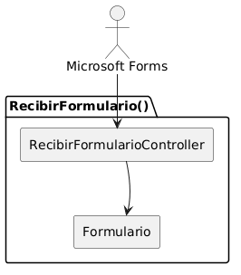
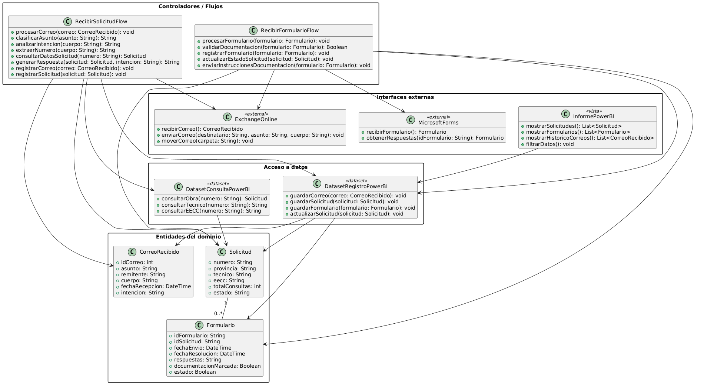
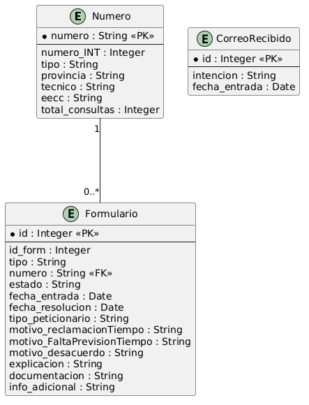
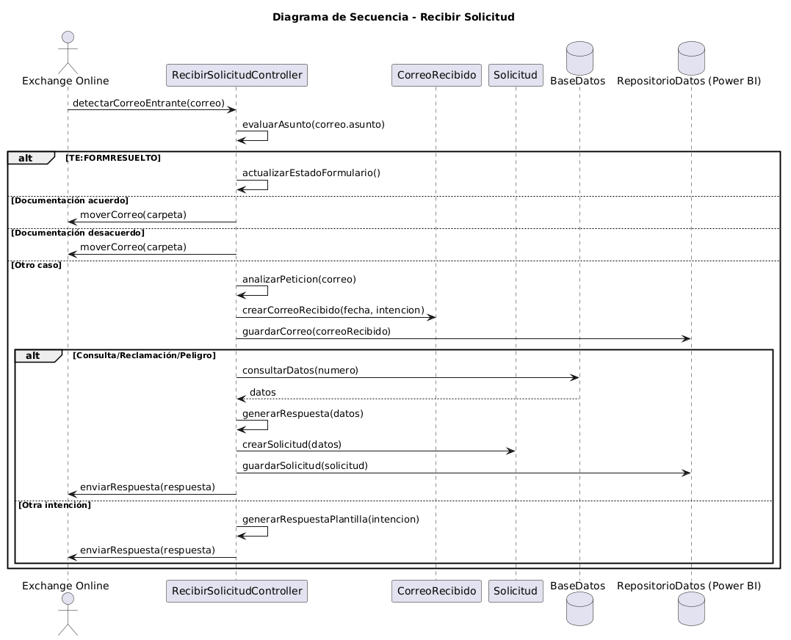
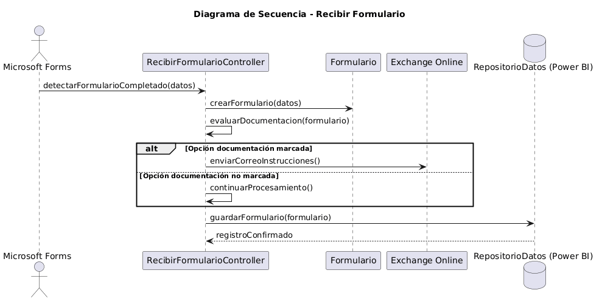
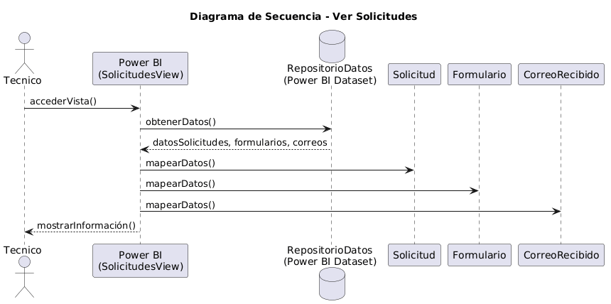

# Análisis y Diseño 
## Análisis

El sistema se basa en un enfoque de automatización orientada a eventos, en el que la mayor parte de los procesos se ejecutan sin intervención directa del usuario. El sistema gestiona solicitudes recibidas a través del correo electrónico, permite su ampliación mediante formularios y ofrece una capa de visualización para su consulta.

A partir de los diagramas de contexto definidos previamente, se identifican los siguientes actores:

Exchange Online, que actúa como origen del flujo principal al generar eventos cuando se recibe un correo en el buzón corporativo.
Microsoft Forms, que genera eventos cuando un formulario es completado, permitiendo ampliar la información de las solicitudes.
Técnico, que consulta la información procesada a través de una vista en Power BI.

A diferencia de sistemas tradicionales, el cliente no se considera actor directo, ya que su interacción se realiza a través de servicios intermedios (correo y formularios), sin comunicación directa con la solución.

A partir de estas interacciones, se construye el análisis del sistema siguiendo la estructura MVC. Sin embargo, es importante destacar que la aplicación de este patrón presenta particularidades en este proyecto: los casos de uso principales (recepción de solicitudes y formularios) no disponen de interfaz de usuario, por lo que las clases vista no están presentes en estos procesos. En su lugar, la capa de visualización se concentra exclusivamente en el caso de uso de consulta, implementado mediante Power BI.

En consecuencia, el sistema se organiza en torno a una capa de control que gestiona los flujos automatizados, una capa de modelo que representa las entidades del dominio (como solicitudes y detalles asociados), y una capa de vista limitada a la visualización de datos para el técnico.

### Identificación de clases de análisis

| Diagrama | Código Fuente |
|----------|---------------|
||[Ver Código](./MVC/codigo/MVC.puml)

En el paquete de **Vistas** se define la clase *SolicitudesView*, que representa la única interfaz de usuario del sistema. Esta vista está implementada mediante Power BI y permite al técnico consultar las solicitudes procesadas. Dado que el sistema se basa en automatización, no existen otras interfaces de interacción directa con el usuario.

En la capa de **Controladores** se incluyen las clases *RecibirSolicitudController*, *RecibirFormularioController* y *VerSolicitudesController*. Estas clases representan la lógica de control asociada a los distintos casos de uso identificados. A diferencia de sistemas tradicionales, estos controladores no responden a acciones directas del usuario, sino a eventos externos. En concreto, los dos primeros gestionan flujos automáticos activados por servicios externos, mientras que el tercero gestiona la interacción del técnico con la vista de consulta.

En el paquete de **Modelos** se encuentran las clases *Solicitud*, *Formulario* y *CorreoRecibido*, que representan las entidades principales del dominio. La clase *Solicitud* constituye el elemento central del sistema, ya que recoge la información asociada a cada petición recibida. La clase *Formulario* permite almacenar la información adicional proporcionada por el usuario mediante formularios, complementando así los datos de la solicitud. La clase *CorreoRecibido*, que representa un historico de las intenciones de los correos que han entrado al buzón.

### Diagramas de Colaboración

#### Diagrama de colaboración: CA1 Recibir solicitud

| Diagrama | Código Fuente |
|----------|---------------|
||[Ver Código](./DdC/codigo/RecibirSolicitud.puml)

En este caso, el actor **Exchange Online** actúa como origen del evento, enviando la solicitud al sistema cuando se recibe un nuevo correo en el buzón corporativo. Este evento es capturado por la clase **RecibirSolicitudController**, que constituye el elemento encargado de gestionar la lógica del proceso.

El controlador actúa como intermediario entre el actor externo y los elementos del modelo. Por un lado, interactúa con la clase **CorreoRecibido**, que representa la información del correo entrante. Esta clase no solo recoge los datos iniciales del mensaje (asunto, remitente, contenido y fecha), sino que además se utiliza para mantener un histórico de las solicitudes recibidas, incluyendo la intención detectada, lo que permite realizar un seguimiento y análisis del volumen de solicitudes por tipo.

Por otro lado, el controlador utiliza la clase **Solicitud** para registrar y gestionar los datos relevantes de la petición dentro del sistema, representando la entidad principal del dominio sobre la que se realiza el procesamiento.

De este modo, se diferencia entre el registro histórico de correos (*CorreoRecibido*) y la entidad operativa del sistema (*Solicitud*), permitiendo tanto el análisis de la información recibida como la gestión de las solicitudes.

Cabe destacar que, a diferencia de otros casos de uso, no existe una clase vista asociada, ya que el proceso se ejecuta de forma automática sin intervención directa del usuario.

#### Diagrama de colaboración: CA2 Recibir Formulario

| Diagrama | Código Fuente |
|----------|---------------|
||[Ver Código](./DdC/codigo/RecibirFormulario.puml)

En este caso, el actor **Microsoft Forms** actúa como origen del evento, enviando los datos al sistema cuando un formulario es completado. Este evento es recibido por la clase **RecibirFormularioController**, que se encarga de gestionar el proceso asociado.

El controlador actúa como intermediario entre el actor externo y el modelo, delegando en la clase **Formulario** la gestión de la información recibida. Esta clase representa los datos introducidos en el formulario y permite su almacenamiento dentro del sistema.

Al igual que en el caso de uso anterior, no existe una clase vista asociada, ya que el proceso se ejecuta automáticamente sin interacción directa del usuario.

#### Diagrama de colaboración: CA3 Ver solicitudes

| Diagrama | Código Fuente |
|----------|---------------|
||[Ver Código](./DdC/codigo/VerSolicitudes.puml)

En este caso, el actor **Técnico** interactúa directamente con la clase *SolicitudesView*, que representa la vista implementada en Power BI. Esta vista permite acceder a la información almacenada en el sistema de forma estructurada.

A diferencia de otros casos de uso, no existe una clase controladora intermedia, ya que la herramienta de visualización accede directamente a los datos. De este modo, la vista se conecta directamente con las clases del modelo *Solicitud*, *Formulario* y *CorreoRecibido*, que contienen la información necesaria para su representación.

La clase *Solicitud* recoge los datos principales asociados a cada petición y constituye la entidad central del sistema. La clase *Formulario* contiene la información adicional proporcionada por el usuario mediante formularios, complementando los datos de la solicitud. Por su parte, la clase *CorreoRecibido* permite disponer de un histórico de los correos procesados, incluyendo la intención detectada, lo que posibilita el análisis del volumen y tipología de solicitudes recibidas.

De este modo, la vista integra información operativa y analítica, permitiendo al técnico no solo consultar el estado de las solicitudes, sino también obtener una visión global del comportamiento del sistema.

## Diseño 

### Decisión Tecnológica

| Diagrama | Código Fuente |
|----------|---------------|
||[Ver Código](./DecisionTecnologica/codigo/Decision_Tecnologica.puml)

El sistema se estructura en torno a una capa de control implementada mediante Power Automate, donde se definen dos flujos principales: **RecibirSolicitudController** y **RecibirFormularioController**. Estos flujos se activan de forma automática a partir de eventos externos y constituyen el núcleo de la lógica del sistema.

Por un lado, **Exchange Online** actúa como punto de entrada para las solicitudes. Cuando se recibe un nuevo correo en el buzón corporativo, se activa el flujo *RecibirSolicitudController*, que procesa la información, consulta en caso necesario los **servicios de información externos** (como APIs o workflows auxiliares) y registra los datos relevantes en el **repositorio de datos**. Además, el sistema genera y envía una respuesta al remitente a través del propio servicio de correo.

Por otro lado, **Microsoft Forms** permite la recogida de información adicional mediante formularios. Cuando un formulario es completado, se activa el flujo *RecibirFormularioController*, que procesa los datos recibidos, puede enviar un correo adicional si procede y registra la información en el repositorio de datos.

El **repositorio de datos**, implementado como dataset de Power BI, actúa como almacenamiento central del sistema, donde se guardan las entidades principales, como solicitudes y formularios.

Finalmente, **Power BI** proporciona la capa de visualización a través de la vista *SolicitudesView*, permitiendo al técnico consultar la información almacenada. El técnico interactúa directamente con esta herramienta, que accede al repositorio de datos sin necesidad de una capa intermedia.

De este modo, la arquitectura separa claramente la captura de eventos, el procesamiento automático, la integración con servicios externos, el almacenamiento de la información y su posterior visualización, garantizando una solución modular y coherente con un sistema orientado a eventos.

### Diagrama de Clases de Diseño
| Diagrama | Código Fuente |
|----------|---------------|
||[Ver Código](./DdC_Diseno/codigo/Diagrama_Clases_Diseno.puml)

En primer lugar, los **controladores**, representados por *RecibirSolicitudFlow* y *RecibirFormularioFlow*, modelan los flujos implementados en Power Automate. Estos se encargan de orquestar la lógica del sistema. El flujo *RecibirSolicitudFlow* procesa los correos electrónicos entrantes, analiza su contenido para identificar la intención, extrae información relevante como el número de solicitud, consulta los datos necesarios y genera una respuesta adecuada. Además, registra tanto el correo recibido como la solicitud en el sistema. Por su parte, *RecibirFormularioFlow* gestiona los formularios enviados por los usuarios, validando la documentación aportada, registrando la información y actualizando el estado de la solicitud correspondiente. En caso necesario, también envía instrucciones adicionales al usuario.

Las **entidades del dominio** incluyen las clases *CorreoRecibido*, *Solicitud* y *Formulario*, que representan los principales elementos de información gestionados por el sistema. Estas clases encapsulan los datos relevantes de cada elemento y permiten estructurar la información de forma coherente. Existe una relación entre *Solicitud* y *Formulario*, donde una solicitud puede estar asociada a múltiples formularios, reflejando el ciclo de vida del proceso.

El bloque de **acceso a datos** está compuesto por dos clases que representan los datasets de Power BI utilizados en la solución. *DatasetConsultaPowerBI* se emplea como fuente de información, permitiendo realizar consultas mediante DAX para obtener datos necesarios durante el procesamiento. Por otro lado, *DatasetRegistroPowerBI* actúa como repositorio de almacenamiento, donde se registran las solicitudes, formularios y correos procesados, además de permitir la actualización de la información existente.

Por último, las **interfaces externas** incluyen los sistemas con los que la solución interactúa. *ExchangeOnline* gestiona la recepción y envío de correos electrónicos, mientras que *MicrosoftForms* permite la recepción de formularios y la obtención de sus respuestas. La clase *InformePowerBI* representa la capa de visualización, encargada de mostrar la información almacenada mediante informes y paneles interactivos.

### Modelo de Datos

| Diagrama | Código Fuente |
|----------|---------------|
||[Ver Código](./ModeloDatos/ModeloDatos.puml)

El modelo de datos del sistema está implementado en Power BI mediante un modelo tabular, el cual permite almacenar, estructurar y analizar la información procesada por los flujos automatizados. Aunque Power BI se utiliza habitualmente como herramienta de visualización, en este caso también actúa como repositorio de datos.

El modelo se compone de tres tablas principales:

#### Tabla `Numero`
Esta tabla representa la entidad principal del sistema, donde se almacena la información asociada a cada solicitud. Cada registro está identificado de manera única mediante el atributo `numero`, que actúa como clave primaria.

Incluye atributos como:
- Tipo de solicitud
- Provincia
- Técnico responsable
- Empresa colaboradora (EECC)
- Número total de consultas

#### Tabla `Formulario`
Esta tabla contiene los formularios asociados a cada solicitud. Recoge información detallada sobre cada interacción, incluyendo:
- Tipo de formulario
- Estado
- Fechas de entrada y resolución
- Tipo de peticionario
- Motivos de reclamación o desacuerdo
- Información adicional proporcionada

El atributo `numero` actúa como clave foránea, permitiendo relacionar cada formulario con su solicitud correspondiente.

#### Tabla `CorreoRecibido`
Esta tabla almacena un histórico de los correos electrónicos que llegan al sistema. Para cada correo se registra:
- La intención detectada
- La fecha de entrada

Su finalidad es permitir el análisis del volumen y tipo de correos recibidos.

#### Relaciones

La única relación existente en el modelo se establece entre las tablas `Numero` y `Formulario`.

- Tipo de relación: **uno a cero o muchos (1:0..N)**
- Interpretación:
  - Una solicitud puede no tener formularios asociados o tener varios.
  - Cada formulario pertenece a una única solicitud.

La tabla `CorreoRecibido` no presenta relaciones con el resto del modelo, ya que su función es servir como histórico independiente de la actividad del buzón.

El modelo presenta una estructura sencilla pero adecuada para los objetivos del sistema. Permite:
- Asociar múltiples formularios a una misma solicitud
- Realizar análisis históricos
- Explotar la información mediante medidas y visualizaciones en Power BI

Además, la separación de la tabla `CorreoRecibido` permite analizar de forma independiente el comportamiento de los correos entrantes sin afectar al resto del modelo.

### Diagramas de Secuencia por Caso de Uso 

#### Recibir Solicitud
| Diagrama | Código Fuente |
|----------|---------------|
||[Ver Código](./DdS/codigo/RecibirSolicitud.puml)

El proceso se inicia cuando **Exchange Online** detecta la llegada de un nuevo correo en el buzón corporativo y notifica al **RecibirSolicitudController**, que actúa como elemento central de control del sistema.

En una primera fase, el controlador evalúa el asunto del correo para identificar si corresponde a alguno de los casos predefinidos. Si el asunto indica que un formulario ha sido resuelto, el sistema actualiza su estado. En los casos de envío de documentación, el correo es clasificado y movido a la carpeta correspondiente, finalizando el flujo sin procesamiento adicional.

Si el asunto no coincide con estos casos, el sistema entra en una segunda fase de análisis, en la que se procesa el contenido del correo para identificar la intención de la solicitud. A continuación, se crea un registro en la entidad **CorreoRecibido**, que se almacena en el repositorio de datos, permitiendo mantener un histórico de las solicitudes y facilitar su análisis posterior.

En función de la intención detectada, el flujo se bifurca. Si se trata de una consulta, reclamación o situación de riesgo, el sistema realiza una consulta a la **Base de Datos** para obtener la información necesaria. Con los datos recuperados, se genera una respuesta específica y se crea una entidad **Solicitud**, que se almacena en el repositorio. Finalmente, se envía la respuesta al remitente a través de Exchange Online.

En aquellos casos en los que la intención no corresponde con los escenarios contemplados, el sistema genera una respuesta basada en una plantilla predefinida y la envía directamente, sin necesidad de consultar datos adicionales ni registrar una solicitud.

#### Recibir Formulario
| Diagrama | Código Fuente |
|----------|---------------|
||[Ver Código](./DdS/codigo/RecibirFormulario.puml)

El flujo se inicia cuando **Microsoft Forms** detecta que un formulario ha sido completado y activa el **RecibirFormularioController**, encargado de gestionar el procesamiento de los datos recibidos.

A continuación, el controlador crea la entidad **Formulario** con la información introducida por el usuario. Después, evalúa si se ha marcado la opción relacionada con el envío de documentación.

Si la opción de documentación está marcada, el sistema envía un correo electrónico con las instrucciones necesarias para remitir la documentación correspondiente a través de **Exchange Online**. Si no está marcada, el flujo continúa sin realizar este envío adicional.

Finalmente, independientemente de la opción seleccionada, el sistema guarda la información del formulario en el **RepositorioDatos (Power BI)**, dejando los datos disponibles para su posterior consulta desde la vista de solicitudes.

#### Ver Solicitudes Pendientes
| Diagrama | Código Fuente |
|----------|---------------|
||[Ver Código](./DdS/codigo/VerSolicitudes.puml)

El flujo se inicia cuando el **Técnico** accede a la vista de solicitudes, implementada en Power BI. Esta acción provoca que la vista realice una petición al **Repositorio de Datos**, donde se almacena toda la información generada por el sistema.

El repositorio devuelve los datos correspondientes a las distintas entidades del sistema, incluyendo solicitudes, formularios y el histórico de correos recibidos. A continuación, la vista procesa esta información, mapeando los datos a las entidades **Solicitud**, **Formulario** y **CorreoRecibido** para su correcta interpretación.

Finalmente, la vista presenta la información al técnico de forma estructurada, permitiendo su consulta y análisis. Este proceso se realiza sin intervención de una capa de control intermedia, ya que Power BI accede directamente a los datos almacenados.

De este modo, el diagrama refleja un flujo simple centrado en la recuperación y visualización de la información, diferenciándose de los otros casos de uso por la ausencia de procesamiento complejo y por su carácter exclusivamente consultivo.

### Diseño de la Implementación

#### Flujo Recibir Correo

El flujo se activa mediante un disparador asociado al buzón corporativo. Una vez recibido el correo, se ejecutan distintas fases:

1. Lectura del correo
   - Obtener asunto
   - Obtener remitente
   - Obtener cuerpo

2. Identificación del tipo de mensaje (según asunto)
   - Cambio de estado del formulario
   - Mover a carpeta "Documentación"
   - Análisis del correo por IA

3. Extracción de información
   - Números de solicitud
   - Intención del correo
     - No requiere consulta
       - Respuesta mediante plantilla
     - Requiere consulta
       - Continuar flujo

4. Iteración por cada número extraído
   - Para cada número:

     4.1 Consulta en base de datos correspondiente
     - Actuaciones (ACT)
     - Wepes (EXP)
     - Petter (PET)

     4.2 Resultado de la consulta
     - Si existen datos:
       - Procesar los datos obtenidos
       - Añadir información a la variable textoCorreo
       - Guardar la información en la base de datos (Solicitud)
       - Continuar con el siguiente número
     - Si no existen datos:
       - Marcar como no encontrado

5. Gestión de resultados globales
   - Calcular números encontrados
   - Generar mensaje para no encontrados (si aplica)

6. Gestión de alertas
   - Añadir texto en caso de situaciones de riesgo

7. Construcción del correo
   - Formar contenido final (textoCorreo)

8. Envío del correo
   - Enviar respuesta al remitente

9. Post-procesado
   - Mover correo a carpeta "Archivo"

#### Flujo Recibir Formulario

1. Recepción del formulario
   - Entrada de la respuesta del formulario en el sistema

2. Validación del contenido
   - Comprobar si se ha marcado la opción "Documentación"

   - Si SÍ requiere documentación:
     - Enviar correo indicando los pasos a seguir para completar la documentación

   - Si NO requiere documentación:
     - Registrar el formulario en la base de datos
       - Número de solicitud
       - Tipo de formulario
       - Estado
       - Resto de datos asociados

#### Vista y Análisis en Power BI

La visualización en Power BI permite analizar la información registrada en el sistema a partir de las tablas Numero y Formulario.

1. Carga de datos
   - Lectura de las tablas Numero y Formulario
   - Aplicación de relaciones (1:0..N)
   - Preparación del modelo para análisis

2. Actualización de datos
   - Datos actualizados desde los flujos de Power Automate
   - Refresco de las visualizaciones

3. Construcción de la vista
   - Uso de la tabla Numero como base
   - Relación con Formulario para detalle
   - Visualización por solicitud

4. Cálculo de métricas
   - Para cada número:

     4.1 Formularios pendientes
     - Conteo de formularios con estado "Pendiente"

     4.2 Formularios resueltos
     - Conteo de formularios con estado "Resuelto"

     4.3 Reclamaciones por falta de fecha
     - Conteo de formularios con motivo "Falta de previsión"

     4.4 Reclamaciones por exceso de tiempo
     - Conteo de formularios con motivo "Incumplimiento de tiempo"

5. Representación de resultados
   - Visualización por solicitud
   - Agregación de métricas
   - Análisis del estado e incidencias

6. Uso de la información
   - Seguimiento de solicitudes
   - Detección de incidencias
   - Apoyo a la toma de decisiones