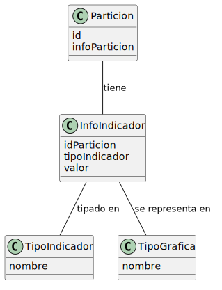
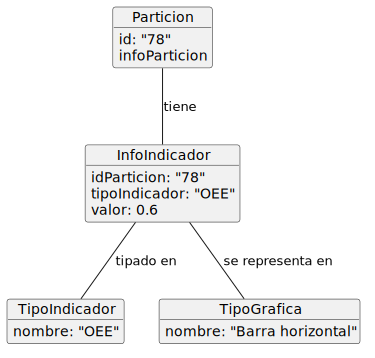
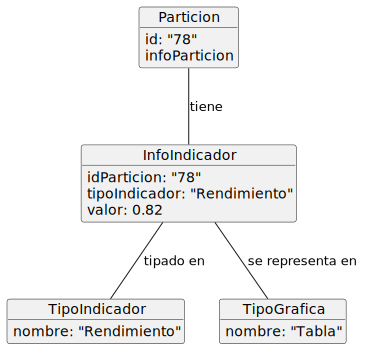
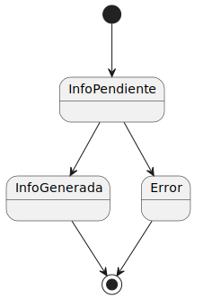
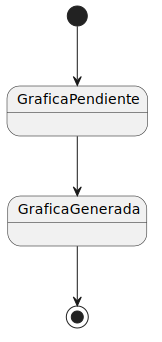
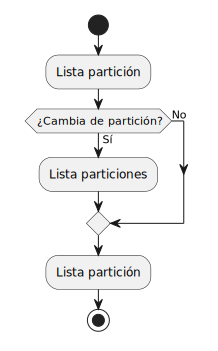

# Modelo del dominio

El modelo del dominio permite representar los principales elementos que intervienen en el sistema y las relaciones existentes entre ellos. 

En este caso, el dominio se sitúa en el entorno de producción de Visual Tracking, donde conviven datos teóricos definidos durante la planificación y datos reales generados durante la ejecución.

## Diagrama de clases
#### Cálculo de indicadores de OEE en VT
| Diagrama | Código Fuente |
|----------|---------------|
||[Ver Código](./modeloDelDominioImagenes/diagramaDeClases.puml)

## Diagrama de objetos
#### OEE en gráfica de barra horizontal
| Diagrama | Código Fuente |
|----------|---------------|
||[Ver Código](./modeloDelDominioImagenes/diagramaDeObjetosOEE.puml)

#### Rendimiento en tabla comparativa
| Diagrama | Código Fuente |
|----------|---------------|
||[Ver Código](./modeloDelDominioImagenes/diagramaDeObjetosRendimiento.puml)

## Diagrama de estados de partición
| Diagrama | Código Fuente |
|----------|---------------|
||[Ver Código](./modeloDelDominioImagenes/diagramaDeEstadosParticion.puml)

## Diagrama de estados de gráfica
| Diagrama | Código Fuente |
|----------|---------------|
||[Ver Código](./modeloDelDominioImagenes/diagramaDeEstadosGrafica.puml)

## Diagrama de actividad

| Diagrama | Código Fuente |
|----------|---------------|
||[Ver Código](./modeloDelDominioImagenes/diagramaActividad.puml)

